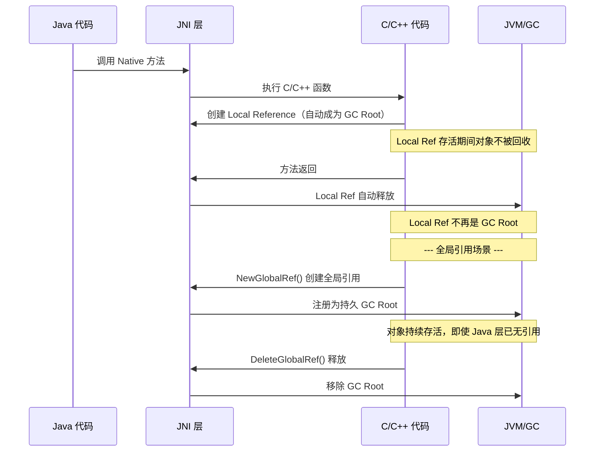

# JNI 详解

> **JNI（Java Native Interface）** 是 Java 平台的标准编程接口，允许 Java 代码与 C/C++ 等本地（Native）语言编写的代码进行交互。它充当了 **Java 虚拟机与本地代码之间的桥梁**。

## 为什么需要 JNI

| 场景 | 说明 |
|------|------|
| **调用已有本地库** | 复用已有的 C/C++ 库（如 OpenGL、音频编解码、加密库） |
| **性能关键路径** | 对 CPU 密集型计算，本地代码可能比 Java 更快（但需注意 JNI 调用开销） |
| **平台特定功能** | 访问操作系统底层 API 或硬件设备 |
| **遗留系统集成** | 与老旧系统的 Native 代码对接 |

> 现代 Java 应用中，JNI 的使用已大幅减少 —— 许多场景被替代方案覆盖：
> - `java.nio` 包提供跨平台 I/O
> - [[JNA详解|JNA（Java Native Access）]] 提供更简单的 Native 调用方式
> - `Project Panama`（JDK 20+ preview）正在开发更现代的替代 API

## JNI 引用类型

JNI 定义了两种引用类型，它们直接影响 GC 行为：

### Local Reference（本地引用）

```cpp
// 在 Native 方法中创建本地引用
jstring localStr = (*env)->NewStringUTF(env, "hello");
// 方法返回后自动释放
```

- **作用域**：仅在创建它的 Native 方法执行期间有效
- **生命周期**：方法返回后自动释放，不需要手动管理
- **作为 GC Root**：方法执行期间可作为 GC Root，方法返回后不再是 Root
- **容量限制**：每个 Native 方法调用默认最多创建 **512 个本地引用**（超过可能 JNI 报错）

### Global Reference（全局引用）

```cpp
// 显式创建全局引用
jobject globalRef = (*env)->NewGlobalRef(env, localObj);
// 必须手动释放
(*env)->DeleteGlobalRef(env, globalRef);
```

- **作用域**：跨方法、跨线程有效
- **生命周期**：直到手动调用 `DeleteGlobalRef()` 才释放
- **作为 GC Root**：**持续作为 GC Root**，只要不释放，Java 对象永远不会被 GC 回收
- **内存泄漏风险**：忘记释放 Global Reference 是 JNI 内存泄漏的主要来源

### Weak Global Reference（弱全局引用）

```cpp
// 创建弱全局引用（不影响 GC）
jweak weakRef = (*env)->NewWeakGlobalRef(env, obj);
```

- 类似 Java 中的 `WeakReference`，不影响对象的 GC 判断
- 需要检查引用是否仍然有效（`IsSameObject`）

## JNI 与 GC Roots

JNI 引用在 **GC Roots** 中占有重要位置。参见 [[GC-Roots详解#GC Roots 分类]]：

```
GC Roots 列表中的 JNI 引用包含两类：
├── Global Reference          → 一直作为 GC Root（直到 DeleteGlobalRef）
└── Local Reference（当前活跃） → 方法执行期间作为 GC Root
```

> [!important] 关键区别
> **Local Reference** 仅在当前 Native 方法执行期间是 GC Root，方法返回后自动失效。
> **Global Reference** 是"永久"的 GC Root（从 JNI 角度看），必须显式释放。

## 典型工作流程



## 内存泄漏场景

```java
// Java 端：看似可以被回收
class JNICache {
    static native void cacheObject(Object obj);  // Native 层 NewGlobalRef
    static native void clearCache();             // Native 层 DeleteGlobalRef
}

// 忘记调用 clearCache() → obj 永远不会被 GC
```

即使 Java 层没有任何引用指向该对象，只要 Native 层持有 **Global Reference**，该对象就不会被 GC 回收。这是 JNI 内存泄漏的典型场景。

## 性能注意事项

1. **JNI 调用开销**：每次 JNI 调用约耗时 20-50 个 CPU 周期（相比普通 Java 方法调用约 1-2 个周期）
2. **数据拷贝**：跨越 JNI 边界传递大数据需要序列化/反序列化
3. **GC 暂停影响**：Native 代码执行期间，JVM 无法移动对象（对于支持压缩指针和对象移动的 GC）

## 参考链接

- [[GC-Roots详解]] — JNI 引用作为 GC Root 的详细分类
- [[JNA详解]] — 更简单的 Native 调用方案（JNA）
- [[JVM-堆内存分代模型]] — JVM 堆内存模型
- [[JVM-OOM排查指南]] — JNI 引用可能导致 OOM
