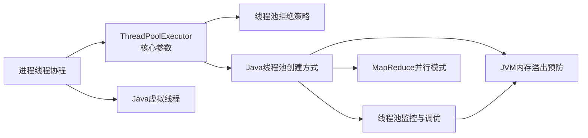

# Java 线程池与内存管理 — 知识地图

> [!abstract] 本笔记为 MOC（Map of Content）
> 这是 Java 并发编程中**线程池与内存管理**主题的入口。点击下方链接跳转到对应的原子笔记。

---

## 🧱 基础概念

| 笔记 | 简介 |
|------|------|
| [[进程线程协程]] | 进程、线程、协程的定义、特性对比与应用场景选型 |

## ⚙️ 线程池核心

| 笔记 | 简介 |
|------|------|
| [[ThreadPoolExecutor核心参数]] | 七大构造参数详解、工作流程、工作队列类型与风险 |
| [[线程池拒绝策略]] | AbortPolicy / CallerRunsPolicy / DiscardPolicy / DiscardOldestPolicy 详解与选型 |
| [[Java线程池创建方式]] | Executors 工厂方法的陷阱、手动创建推荐配置、线程数公式、门店销售实战案例 |
| [[Java虚拟线程]] | JDK 21+ Project Loom 虚拟线程的原理、使用方式、与平台线程对比 |

## 📊 运维与调优

| 笔记 | 简介 |
|------|------|
| [[线程池监控与调优]] | 监控指标、动态参数调整、告警阈值建议 |

## 🧩 并行模式

| 笔记 | 简介 |
|------|------|
| [[MapReduce并行模式]] | 分治法（Map-Reduce）的原理、实现示例、与虚拟线程的结合 |

## 🛡️ 内存管理

| 笔记 | 简介 |
|------|------|
| [[JVM内存溢出预防]] | OOM 类型、线程池相关预防、流式查询与分页优化、JVM 参数配置 |

---

## 关键联系：线程池的本质

**线程池本质上是对线程生命周期的管理工具** —— 既然线程创建/销毁开销大（因涉及内核态系统调用），通过池化复用线程来减少开销。

```
任务提交 → [有界队列] → [最大线程限制] → [拒绝策略]
              ▼              ▼              ▼
         防队列无限增长    防线程过多      最后的保护
```

而**协程的出现进一步挑战了线程池的必要性**：
- 线程池 = 复用 OS 线程，限制并发数
- 虚拟线程（JDK 21+）= 每个任务一个虚拟线程，无需池化，创建即用

---

## 选型指南

### 线程池选型

| 场景 | 推荐配置 | 说明 |
|------|---------|------|
| CPU 密集型计算 | 核心线程数 = CPU 核心数 + 1 | 减少线程切换开销 |
| I/O 密集型操作 | 核心线程数 = CPU 核心数 × 2 | 充分利用 CPU 等待时间 |
| 批量数据处理 | 有界队列 + `CallerRunsPolicy` | 防止 OOM，允许降级 |
| 实时任务处理 | `SynchronousQueue` + 足够最大线程数 | 低延迟，快速响应 |
| 高并发 I/O（JDK 21+） | **虚拟线程**（[[Java虚拟线程]]） | 每个任务一个虚拟线程 |

### 瑞幸场景最佳实践

| 场景 | 推荐方案 | 参考笔记 |
|------|---------|---------|
| 每日批量计算 | 固定大小线程池 + 分页查询 + Map-Reduce | [[Java线程池创建方式]]、[[MapReduce并行模式]] |
| 实时订单处理 | 有界队列线程池 + `CallerRunsPolicy` | [[ThreadPoolExecutor核心参数]] |
| 异步任务处理 | `CompletableFuture` + 自定义线程池 | [[Java线程池创建方式]] |

### 防 OOM Checklist

- [ ] 使用有界队列（设置合理容量）
- [ ] 避免使用 `Executors.newCachedThreadPool()`
- [ ] 数据库查询使用分页 / 流式读取
- [ ] 设置合理的 `maximumPoolSize`
- [ ] 配置合理的拒绝策略（[[线程池拒绝策略]]）
- [ ] 监控队列积压（[[线程池监控与调优]]）
- [ ] 设置合理的 JVM 堆内存大小
- [ ] 配置 OOM 自动堆转储

---

## 总结：学习路径

从基础概念到高级实践，建议按以下顺序阅读：



---

## 面试相关

- [[瑞幸后端-Q3-批量计算门店销售-线程池与内存管理|Q3 — 批量计算门店销售：线程池与内存管理]]

## 相关笔记

- [[synchronized机制详解]] — Java 内置锁机制
- [[乐观锁]] 和 [[悲观锁]] — 并发控制哲学
- [[CAS-Compare-And-Swap]] — CAS 无锁机制
- [[Java并发集合-ConcurrentHashMap]] — 线程安全的哈希表
- [[volatile关键字详解]] — volatile 内存可见性
