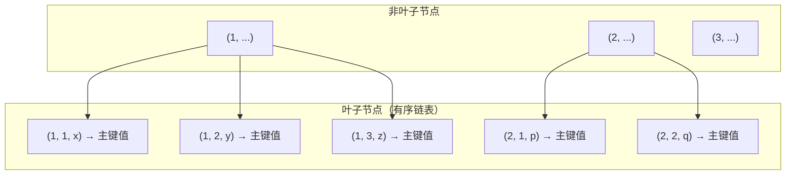

# MySQL联合索引

联合索引（Composite Index / Compound Index）是一种==包含多个列的 B+Tree 索引==。它遵循最左前缀规则（Leftmost Prefix Rule）排序和匹配，是 MySQL 查询优化中最常用也最容易出错的索引类型。

---

## 联合索引的 B+Tree 结构

联合索引 `(a, b, c)` 在 B+Tree 中的排序逻辑：

1. **先按 a 列排序**
2. a 列相同的情况下按 b 列排序
3. a、b 都相同的情况下按 c 列排序



> [!info] 联合索引本质
> 联合索引不是"多列各自索引"，而是在 B+Tree 中用**多列拼接的元组**作为排序键。因此，它只能从最左列开始逐层匹配。

---

## 最左前缀原则

### 规则

查询条件必须从联合索引的最左列开始，并遵循索引定义的列顺序，才能使用索引。

### 命中情况示例

```sql
CREATE INDEX idx_a_b_c ON t(a, b, c);

-- ✅ 完全命中索引
WHERE a = 1 AND b = 2 AND c = 3

-- ✅ 命中前两列（Extra: Using index condition，用到索引下推）
WHERE a = 1 AND b = 2

-- ✅ 命中第一列 + 第三列
-- a 用于索引过滤，c 通过索引下推（ICP）在存储引擎层过滤
WHERE a = 1 AND c = 3

-- ✅ 等值 + 范围：a、b 命中索引
WHERE a = 1 AND b > 10 AND c = 3
-- ⚠️ b 使用范围查询后，c 无法通过索引定位
-- （B+Tree 中在 b > 10 范围内，c 是无序的）
```

### 不命中示例

```sql
-- ❌ 未从最左列开始
WHERE b = 2
WHERE c = 3
WHERE b = 2 AND c = 3

-- ❌ 跳过了中间列
-- 只用到 a，b 之后的部分无法利用索引
WHERE a = 1 AND c = 3  -- 仅 a 走索引，c 为 ICP
```

> [!quote] 理解本质
> 联合索引 `(a, b, c)` 的排序相当于 Excel 中按 A 列升序 → B 列升序 → C 列升序排序。在 A 列值相同的行内，B 列才有序；跳过 B 列直接查 C 列时，C 列整体处于无序状态，B+Tree 无法二分查找。

---

## 索引下推（Index Condition Pushdown, ICP）

**MySQL 5.6+** 引入的优化，允许在**索引遍历过程中**对索引中包含的列进行条件过滤，减少回表次数。

```sql
CREATE INDEX idx_a_b_c ON t(a, b, c);

-- 查询：a = 1 AND c LIKE '%keyword%'
SELECT * FROM t WHERE a = 1 AND c LIKE '%keyword%';
```

### 无 ICP（MySQL 5.6 之前）

1. 通过索引找到所有 `a = 1` 的记录（假设 100 条）
2. **全部回表**获取完整行数据
3. 在 Server 层对 c 进行 `LIKE` 过滤（回表 100 次，最终可能只返回 3 条）

### 有 ICP（MySQL 5.6+）

1. 通过索引找到所有 `a = 1` 的记录
2. **在存储引擎层**通过索引中的 c 列值直接过滤（过滤掉 97 条）
3. 仅对剩下的 3 条 **回表**（回表 3 次）

```sql
-- EXPLAIN 中 Extra 列显示 Using index condition 即表示使用了 ICP
EXPLAIN SELECT * FROM t WHERE a = 1 AND c LIKE '%keyword%';
-- Extra: Using index condition
```

> [!tip] ICP 的限制
> - ICP 只适用于**二级索引**（不适用于聚簇索引，因为聚簇索引本来就在回表过程中的"起点"）
> - ICP 不能推送到包含函数操作的条件下
> - ICP 只用于 `range`、`ref`、`eq_ref`、`ref_or_null` 等访问方法

---

## 列顺序优化策略

良好的列顺序是联合索引设计的核心。

### 策略一：高选择度优先

```sql
-- user 表：gender（2种值）, city（100种值）, status（3种值）, create_time（几乎唯一）
-- 高选择度列放前面，过滤效率高
CREATE INDEX idx_create_time_status ON user(create_time, status);
-- vs
CREATE INDEX idx_status_create_time ON user(status, create_time);  -- ❌ 选择度太低
```

### 策略二：等值条件优先于范围条件

```sql
-- ✅ 推荐：a 等值，b 范围
-- 索引 (a, b)：a 快速过滤到目标组，b 在组内有序可做范围
WHERE a = 1 AND b > 10

-- ❌ 不推荐：b 等值，a 范围
-- 索引 (a, b)：a 做了范围后，b 在范围内无序
WHERE a > 10 AND b = 1
```

### 策略三：考虑查询频率（业务驱动）

```sql
-- 业务 SQL 分布：
-- 查询1（高频）：WHERE user_id = ? AND status = ?  → 索引 (user_id, status)
-- 查询2（中频）：WHERE user_id = ? AND create_time > ?  → 已有 (user_id, ...)
-- 查询3（低频）：WHERE status = ?  → 单独索引 (status)

-- 综合最优：一个索引满足 80% 的需求
CREATE INDEX idx_user_status ON `order`(user_id, status);
CREATE INDEX idx_status ON `order`(status);
```

### 策略四：考虑排序

```sql
-- 如果查询中经常需要 ORDER BY b, c
-- 且索引 (a, b, c) 正好和排序方向一致 → 避免额外 filesort
WHERE a = 1 ORDER BY b, c  -- 索引可以同时满足过滤和排序

-- 降序索引（MySQL 8.0+）
CREATE INDEX idx_asc_desc ON t(a ASC, b DESC);
```

---

## 联合索引与排序（Using filesort 优化）

```sql
CREATE INDEX idx_a_b ON t(a, b);

-- ✅ 走索引，无需额外排序（索引顺序正好符合 ORDER BY）
SELECT * FROM t WHERE a = 1 ORDER BY b;

-- ❌ 需要 filesort（WHERE 条件是范围，b 在范围内无序）
SELECT * FROM t WHERE a > 1 ORDER BY b;

-- ❌ 需要 filesort（排序方向不一致）
SELECT * FROM t WHERE a = 1 ORDER BY b DESC;

-- ✅ 使用降序索引（MySQL 8.0+）
CREATE INDEX idx_a_b_desc ON t(a, b DESC);
SELECT * FROM t WHERE a = 1 ORDER BY b DESC;
```

---

## 联合索引与锁

InnoDB 的 **Next-Key Lock** 依赖于索引：

```sql
-- 假设索引 (a, b)，数据：a=1,b=1; a=1,b=5; a=1,b=10

-- 事务 A
BEGIN;
SELECT * FROM t WHERE a = 1 AND b = 5 FOR UPDATE;

-- 锁住的间隙：(1,1)-(1,5), (1,5)-(1,10) —— 行锁 + 间隙锁
```

> [!info] 索引与锁的关系
> 没有索引的更新操作会导致[[锁机制实现详解#表锁]]——InnoDB 在无索引时升级为锁全表。所以在 `UPDATE` / `DELETE` 的 WHERE 条件列上建索引至关重要。

---

## 面试要点

| 问题 | 要点 |
|------|------|
| 联合索引 `(a, b)` 和两个单列索引 `(a) + (b)` 有何不同 | 联合索引共享一棵 B+Tree，两列按 (a,b) 排序；单列各建一棵树，互不干扰 |
| `WHERE a = 1 AND b = 2` 走 `(a, b)` 还是 `(b, a)` | 优化器会基于选择度选择，但最好按查询模式设计索引顺序 |
| `WHERE a = 1 ORDER BY b DESC` 是否走索引 | 走索引过滤 a，但排序方向不同可能需要 filesort；MySQL 8.0 可建降序索引 |
| 为什么尽量不要超过 3-4 列联合索引 | 列数多 → B+Tree 元组变长 → 每页条目少 → 树高增加；且维护成本指数级增长 |

## 相关笔记

- [[MySQL索引类型]] — 索引分类总览
- [[MySQL索引创建原则]] — 索引创建注意事项与常见误区
- [[主键索引与唯一索引的区别]]
- [[接口性能排查指南]] — EXPLAIN 分析、慢 SQL 优化实战
- [[锁机制实现详解]] — Next-Key Lock 与索引的依赖关系
- [[MySQL深度分页优化]] — 深度分页与索引应用
- [[快手电商-一面-19题总结]] — Q9 深度分页优化
