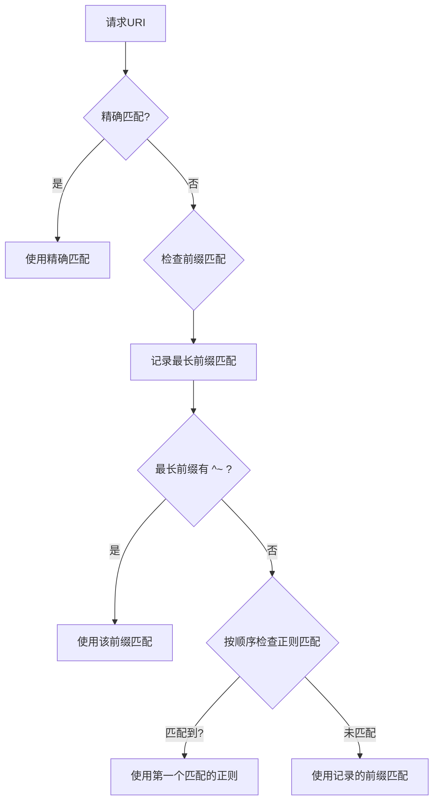

# nginx location块

location 块有5中写法，按优先级从高到低，依次如下：

|          类型          |          语法示例          | 匹配规则                                      | 优先级 |
| :--------------------: | :------------------------: | :-------------------------------------------- | :----: |
|        精确匹配        |     `location = /path`     | 只匹配完全相同的路径                          |  最高  |
|      优先前缀匹配      |   `location ^~ /prefix`    | 匹配指定前缀 符合后不在选择其他适合的正则匹配 |  次高  |
|        正则匹配        |    `location ~ \.php$`     | 区分大小写的正则匹配                          |   中   |
| 正则匹配（忽略大小写） | `location ~* .(jpg\|png)$` | 不区分大小写的正则匹配                        |   中   |
|      普通前缀匹配      |        `location /`        | 匹配任意以指定前缀开头的路径                  |  最低  |

> 正则匹配之间的优先级取决于先后顺序

## 相关笔记

- [[Nginx-try-files]]