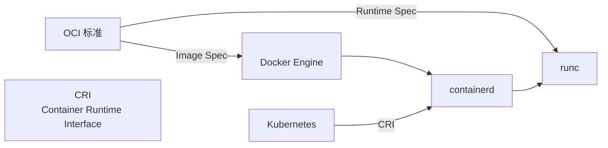

# OCI 协议规范

> [!info] 一句话概括
> **OCI（Open Container Initiative，开放容器倡议）** 是 Linux 基金会于 2015 年 6 月主导成立的一个**开放治理机构**，旨在制定容器格式和运行时的**行业统一标准**，避免容器生态碎片化。

## 背景

2013 年 Docker 发布后，容器技术迅速普及，但围绕容器镜像格式和运行时出现了多种互不兼容的实现（Docker、CoreOS rkt、Mesos 等），形成生态碎片化风险。

2015 年，Docker 公司将容器格式和运行时的规范捐献给 Linux 基金会，与 CoreOS 等厂商联合成立 OCI，制定统一的开放标准。

> [!tip] 核心目标
> - 保证容器镜像的**可移植性**（build once, run anywhere）
> - 保证容器运行时的**互操作性**（任何 OCI 兼容引擎能用同一种方式运行容器）

## OCI 三大核心规范

### 1. OCI Image Spec — 镜像规范

定义容器镜像的标准格式，核心要素：

| 组件 | 说明 |
|:-----|:------|
| **Manifest**（清单） | 描述镜像的元数据，包含配置层和各层的 digest |
| **Index**（索引） | 多架构镜像的入口点，引用多个平台对应的 Manifest |
| **Layer**（层） | 以 **content-addressable** 方式存储的文件系统变更集（tar 包），每层有唯一 SHA256 digest |
| **Config**（配置） | JSON 文件，记录容器运行所需配置（env、entrypoint、cmd、working dir 等） |

**关键特性**：
- **Content-addressable**：每一层通过其内容的 SHA256 hash（digest）来寻址，而非任意的标签名，保证内容完整性
- **不可变层（Immutable Layers）**：每层一旦构建完成即不可变，镜像构建时通过缓存相同 digest 的层加速
- **多架构支持**：通过 Image Index 机制，一个 tag 可同时包含 amd64、arm64 等不同架构的镜像

```
镜像仓库
 └── repository:tag
      └── Index (可选)
           ├── Manifest (linux/amd64)
           │    ├── Config (JSON)
           │    ├── Layer (sha256:abc...)
           │    ├── Layer (sha256:def...)
           │    └── ...
           └── Manifest (linux/arm64)
                └── ...
```

### 2. OCI Runtime Spec — 运行时规范

定义容器的**生命周期标准**，规定容器引擎如何创建、启动、停止容器。

- **Spec 文件**（`config.json`）：描述容器的完整配置（rootfs 路径、mount 点、进程信息、namespace、capabilities、cgroup 资源限制等）
- **容器生命周期**：create → start → stop → delete
- **底层实现**：知名的 OCI 兼容运行时包括 [[Docker-cgroup-v2-兼容性问题|runc]]（Docker 默认）、containerd-shim、crun（C 语言实现，性能更优）等

### 3. OCI Distribution Spec — 分发规范

定义**容器镜像的推送、拉取和存储 API**，统一客户端与镜像仓库的通信协议。

- 基于 HTTP(S) 的 RESTful API
- 核心接口：Blob 上传/下载、Manifest 管理、Tag 列表查询
- 认证机制：支持 Token 认证（Bearer token）和 Basic Auth
- **Referrers API**（OCI v1.1+）：支持将签名（Cosign、Notation）、SBOM、扫描报告等工件作为镜像的附属引用关联存储

> [!example] OCI Distribution 典型流程
> ```
> docker pull alpine:latest
> # 1. 查询 Tag → 获取 Manifest digest
> # 2. 根据 Manifest 获取 Config
> # 3. 依次拉取各 Layer（可并发）
> # 4. 验证每层的 SHA256 digest → 组装 Rootfs
> ```

## OCI 与 Docker、Kubernetes 的关系



- **Docker** 是最早的容器引擎，也是 OCI 标准的主要推动者
- **containerd** 是 Docker 捐赠给 CNCF 的容器运行时管理层，实现了 CRI（Container Runtime Interface），对接 Kubernetes 和 OCI 兼容运行时
- **runc** 是 OCI Runtime Spec 的参考实现，当前 Docker 和 containerd 的默认底层运行时
- **Kubernetes** 通过 **CRI** 抽象层与容器运行时解耦，底层仍使用 OCI 兼容的实现

## OCI 与 Helm Chart 的关系

从 Helm v3.8.0 开始，Helm 支持以 **OCI 协议** 推送和拉取 Chart 包。Chart 被包装为 OCI 镜像存储到容器仓库中，实现 Chart 的**统一版本管理**和**访问控制**。

> [!seealso] 实践参考
> 详见 [[helm-push-实践记录#🚀 推送步骤（OCI 方式）]]，记录如何使用 `helm push oci://` 推送 Chart。

## 相关笔记

- [[Docker容器技术]] — Docker MOC，涵盖 Dockerfile 指令、网络和运行时兼容性
- [[Docker-cgroup-v2-兼容性问题]] — runc 在 cgroup v2 下的兼容性问题
- [[Docker-Exec形式与Shell形式]] — Dockerfile 指令执行方式
- [[helm-push-实践记录]] — 使用 OCI 协议推送 Helm Chart 的实践
- [[案例-Docker-iptables模式切换导致链缺失]] — Docker 运行时网络问题
