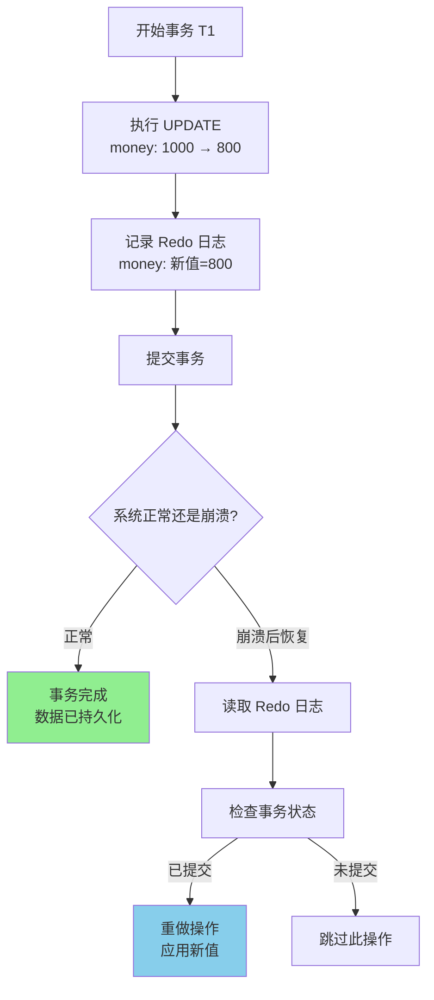

# Redo 日志详解

## 什么是 Redo 日志

**Redo 日志 = 用来重做操作的日志**

记录的是"**修改后的值**"（新值），用于在系统崩溃后重做已提交事务的修改。

### 为什么需要日志

在数据库系统中，日志是保证数据持久性和原子性的核心机制：

- **事务可能失败**：程序崩溃、系统宕机、硬件故障
- **我们需要恢复**：故障后要能恢复到一致状态
- **日志是关键**：先写日志再写数据（WAL - Write-Ahead Logging）

## Redo 日志格式

```sql
[Redo Log] <事务ID, 表名, 主键, 列名, 新值>
```

## 具体示例

**场景**：银行转账 - 张三的账户从 1000 元扣款 200 元

**初始状态**：
```
账户表 (accounts)
+----+--------+-------+
| id | name   | money |
+----+--------+-------+
| 1  | 张三   | 1000  |
| 2  | 李四   | 500   |
+----+--------+-------+
```

**执行 UPDATE 操作**：
```sql
UPDATE accounts SET money = money - 200 WHERE id = 1;
```

**生成的 Redo 日志**：
```
Redo Log: <事务T1, accounts, id=1, money, 新值=800>
```

**流程图解**：



## Redo 日志的特点

| 特点   | 说明                      |
| ---- | ----------------------- |
| 顺序写入 | Redo 日志是顺序写的，比随机写数据页快很多 |
| 物理日志 | 记录的是物理页的变化              |
| 持久化  | 事务提交前必须确保 Redo 日志已落盘    |
| 崩溃恢复 | 用于恢复已提交事务的修改            |

## Redo 日志的存储

- **InnoDB**：ib_logfile0, ib_logfile1（循环写入）
- **Oracle**：在线重做日志文件（Online Redo Log）
- **SQL Server**：事务日志文件（.ldf）

## WAL（Write-Ahead Logging）原则

**先写 Redo 日志，再写数据页**。如果数据页先写入了，但系统崩溃，Redo 日志丢失，就会导致数据不一致。先写 Redo 日志，即使数据页没写入，也能通过 Redo 恢复。

```
事务开始
    ↓
记录 Redo 日志（修改后的值）
    ↓
Redo 日志刷盘 ← 关键！确保持久性
    ↓
提交事务
    ↓
数据页异步刷盘（可延迟）
    ↓
事务结束
```

## Redo 日志与崩溃恢复

**崩溃前状态**：
```
事务T1：已提交，但数据未刷盘
事务T2：未提交，已修改数据
```

**恢复后**：
```
1. 扫描 Redo 日志
2. T1 已提交 → 重做 T1 的修改 ✓
3. T2 未提交 → 配合 Undo 日志回滚
```

## 实际日志示例（InnoDB）

```sql
-- Redo日志示例（内部结构）
Redo Log Entry:
  Type: MLOG_UPDATE_WRITE
  Space ID: 1
  Page Number: 5
  Offset: 100
  Data: (id=1, name='张三', balance=800)
```

## 类比：Redis 的 AOF

| Redis 机制 | 对应数据库概念 |
|-----------|---------------|
| AOF（Append Only File） | Redo 日志 |
| RDB（快照） | 数据页备份 |
| AOF重写 | 压缩日志 |

## 面试要点

**Q：为什么 Redo 日志要先于数据页写入？**

A：这就是 WAL 原则。如果数据页先写入了，但系统崩溃，Redo 日志丢失，就会导致数据不一致。先写 Redo 日志，即使数据页没写入，也能通过 Redo 恢复。

**Q：Redo 日志文件为什么是循环使用的？**

A：为了控制文件大小，采用循环写入策略。新数据覆盖旧数据，但覆盖前要确保相关修改已刷盘。

## 参考链接

- [[Undo日志详解]] — Undo 日志（回滚日志）
- [[Undo-Redo日志]] — Undo/Redo 对比与组合知识地图（MOC）
- [[事务ACID]] — 事务的持久性由 Redo 日志保证
- [[Mysql常用配置]] — MySQL 8 Redo 日志配置
- [[MySQL Binlog 日志配置]] — Binlog 与两阶段提交
- [[快手电商-一面-19题总结]] — Q8 MySQL 两阶段提交