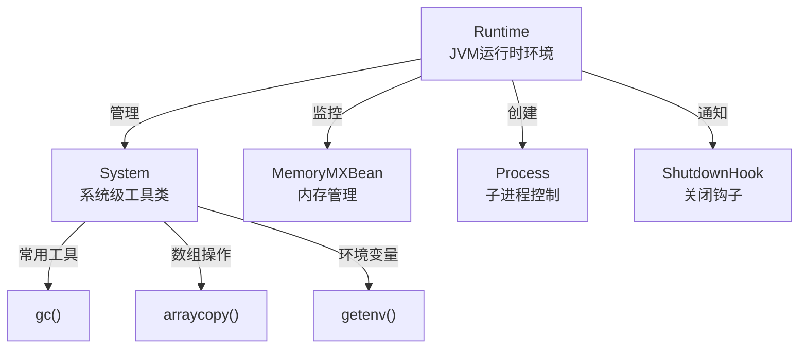

# `java.lang.Runtime` 类详解

> [!info] 一句话
> `Runtime` 是 Java 中代表 **JVM 运行时环境**的核心类，采用**单例模式**，每个 JVM 进程只有一个实例，提供与 JVM 运行状态交互的能力。

## 单例获取方式

```java
Runtime runtime = Runtime.getRuntime();
```

`Runtime` 采用 **饿汉式单例**，JVM 启动时即创建实例：

```java
// JDK 源码示意
private static Runtime currentRuntime = new Runtime();
public static Runtime getRuntime() {
    return currentRuntime;
}
```

详见 [[单例模式]] 中对饿汉式实现的讲解。

---

## 核心方法总览

### 1. 系统信息查询

| 方法 | 返回值 | 说明 |
|------|--------|------|
| `availableProcessors()` | `int` | JVM 可见的 CPU 核心数（详见 [[Runtime.availableProcessors]]） |
| `freeMemory()` | `long` | JVM 当前**空闲**堆内存（字节） |
| `totalMemory()` | `long` | JVM 当前**已分配**堆内存（字节） |
| `maxMemory()` | `long` | JVM 可用的**最大**堆内存（`-Xmx`，字节） |

```java
Runtime rt = Runtime.getRuntime();
System.out.println("CPU核数: " + rt.availableProcessors());
System.out.println("空闲内存: " + rt.freeMemory() / 1024 / 1024 + " MB");
System.out.println("已分配: " + rt.totalMemory() / 1024 / 1024 + " MB");
System.out.println("最大可用: " + rt.maxMemory() / 1024 / 1024 + " MB");
```

> [!tip] 内存监控场景
> 在自行实现内存监控、健康检查接口时，可通过 `Runtime` 获取 JVM 内存使用率：
> `使用率 = (totalMemory - freeMemory) / maxMemory`

### 2. GC 触发

```java
System.gc();  // 等价于 Runtime.getRuntime().gc();
```

```java
public void gc() {
    // 通知 JVM 进行垃圾回收（仅是建议，不保证立即执行）
}
```

> [!warning] 不建议频繁调用
> 频繁调用 `gc()` 会触发 Full GC，导致 STW（Stop-The-World），影响系统性能。除非明确场景（如批量任务完成后），否则让 JVM 自行决定 GC 时机。

### 3. 外部命令执行

```java
// 方式一：执行简单命令
Process process = Runtime.getRuntime().exec("ping 127.0.0.1");

// 方式二：指定环境变量和工作目录
Process process = Runtime.getRuntime().exec(
    new String[]{"java", "-version"},   // 命令 + 参数
    new String[]{"JAVA_HOME=/path"},     // 环境变量
    new File("/work/dir")                // 工作目录
);

// 方式三：通过 ProcessBuilder（推荐）
ProcessBuilder pb = new ProcessBuilder("ping", "127.0.0.1");
Process process = pb.start();
```

> [!danger] 必须处理子进程的输出流
> `exec()` 启动的子进程输出会写入缓冲区，若不及时读取，**缓冲区满后子进程会阻塞**。标准处理方式：

```java
Process process = Runtime.getRuntime().exec("ping 127.0.0.1");

// 必须读取子进程的输出流和错误流（在新线程中）
try (BufferedReader reader = new BufferedReader(
        new InputStreamReader(process.getInputStream()))) {
    String line;
    while ((line = reader.readLine()) != null) {
        System.out.println(line);
    }
}

int exitCode = process.waitFor();  // 等待子进程结束
```

### 4. JVM 退出与关闭钩子

```java
// 正常退出 JVM（参数为退出状态码，非 0 表示异常退出）
Runtime.getRuntime().exit(0);

// 强制退出（不运行关闭钩子）
Runtime.getRuntime().halt(1);

// 添加关闭钩子（JVM 正常退出时执行）
Runtime.getRuntime().addShutdownHook(new Thread(() -> {
    System.out.println("JVM 关闭，清理资源...");
    // 关闭数据库连接池、释放文件句柄等
}));
```

```java
// 典型应用：优雅关闭线程池
Runtime.getRuntime().addShutdownHook(new Thread(() -> {
    System.out.println("正在关闭线程池...");
    ExecutorService executor = ...;
    executor.shutdown();
    try {
        if (!executor.awaitTermination(5, TimeUnit.SECONDS)) {
            executor.shutdownNow();
        }
    } catch (InterruptedException e) {
        executor.shutdownNow();
    }
}));
```

> [!tip]
> - `exit()`：执行所有注册的关闭钩子，然后退出 ✅ 推荐
> - `halt()`：立即退出，不执行关闭钩子 ❌ 仅在极端情况使用
> - 多个关闭钩子**并行执行**，不保证顺序

### 5. 加载本地库

```java
// 加载 .dll / .so 动态库
System.loadLibrary("native-lib");  // 从 java.library.path 加载
// 或
Runtime.getRuntime().loadLibrary("native-lib");
```

常用于 JNI（Java Native Interface）调用 C/C++ 代码时加载本地库。

---

## 单例模式在 Runtime 中的应用

`Runtime` 是 JDK 中单例模式最典型的应用之一：

```java
public class Runtime {
    private static final Runtime currentRuntime = new Runtime();
    
    private Runtime() {}  // 私有构造，防止外部实例化
    
    public static Runtime getRuntime() {
        return currentRuntime;
    }
}
```

对比 [[单例模式]] 中的各种实现方式，`Runtime` 采用**饿汉式**（`static final`），原因：
- JVM 启动时必然需要 Runtime 实例
- 不存在延迟加载的需求
- 实现简单、线程安全（类加载时完成初始化）

---

## Runtime 与其他类的协作



> 许多 `System` 类的方法底层委托给 `Runtime`：`System.gc()`、`System.exit()` 等。

---

## 常见面试问题

| 问题 | 要点 |
|------|------|
| Runtime 如何保证单例？ | `static final` 饿汉式，私有构造 |
| `exec()` 有什么陷阱？ | 必须消费子进程的输出流，否则子进程会阻塞 |
| `gc()` 会立即回收吗？ | 不会，只是建议 JVM 进行 GC |
| `exit()` 和 `halt()` 的区别？ | exit 执行关闭钩子后退出；halt 立即强制退出 |
| 关闭钩子有什么注意事项？ | 多个钩子并行执行；钩子中不能再调用 exit() |
| `availableProcessors()` 在容器中如何表现？ | 详见 [[Runtime.availableProcessors]] |

---

## 相关笔记

- [[Runtime.availableProcessors]] — `availableProcessors()` 方法详解及容器注意事项
- [[单例模式]] — 单例模式的各种实现方式
- [[JVM-堆内存分代模型]] — JVM 内存结构
- [[JVM-OOM排查指南]] — 通过 `Runtime` 内存方法监控 OOM
- [[Jackson-ObjectMapper]] — 另一个典型单例应用
