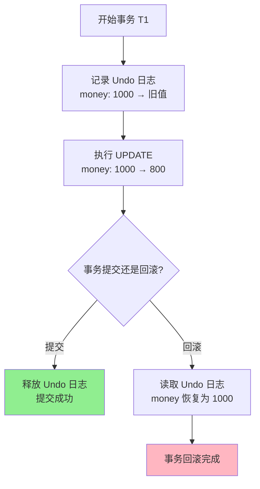
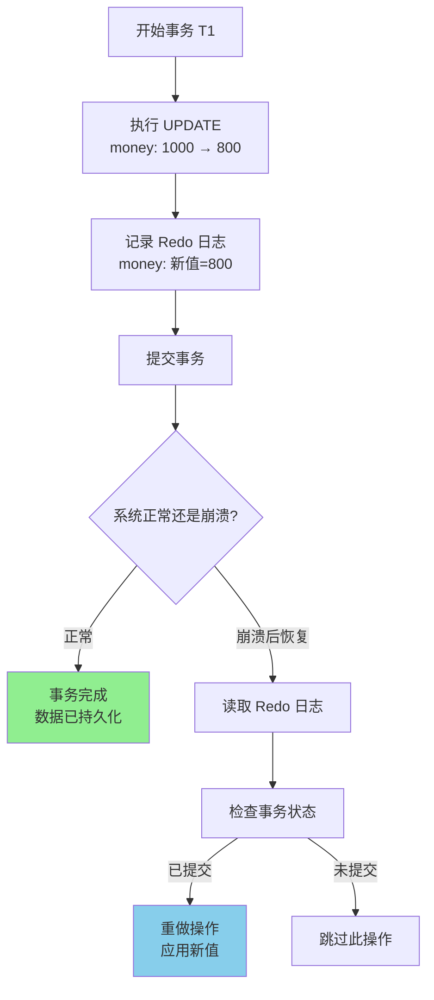
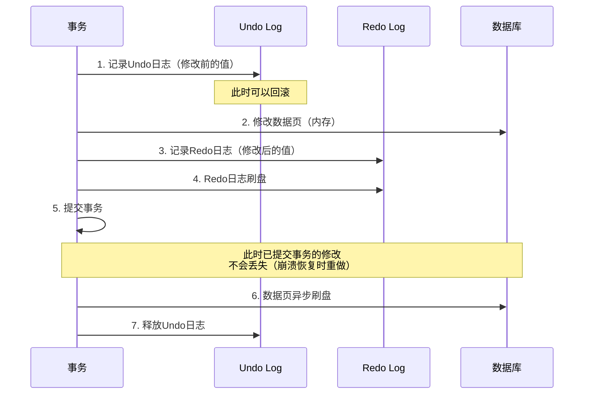
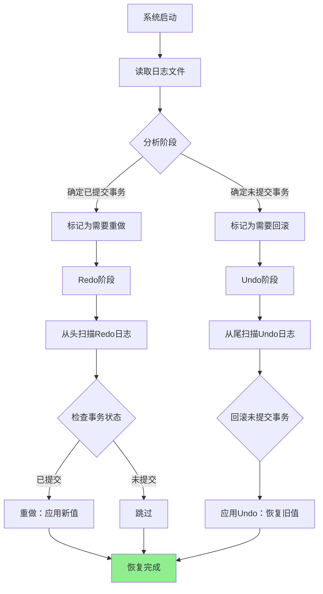
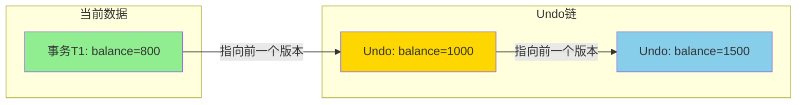

---
tags:
  - topic/数据库事务
  - topic/并发控制
  - "#language/sql"
  - status/to-review
created: 2026-05-23
---

# Undo/Redo 日志详解

## 目录

1. [基本概念](#1-基本概念)
2. [Undo 日志](#2-undo-日志)
3. [Redo 日志](#3-redo-日志)
4. [Undo/Redo 组合日志](#4-undoredo-组合日志)
5. [实际应用场景](#5-实际应用场景)
6. [与数据库隔离级别的关系](#6-与数据库隔离级别的关系)
7. [总结对比](#7-总结对比)

---

MySQL 8 Undo/Redo 日志配置请参考：[MySQL-8-Undo-Redo配置.md](MySQL-8-Undo-Redo配置.md)

---

## 1. 基本概念

### 1.1 为什么需要日志

在数据库系统中，日志是保证数据持久性和原子性的核心机制。简单来说：

- **事务可能失败**：程序崩溃、系统宕机、硬件故障
- **我们需要恢复**：故障后要能恢复到一致状态
- **日志是关键**：先写日志再写数据（WAL - Write-Ahead Logging）

### 1.2 日志的本质

```
日志 = 操作的记录 = 可以重做或撤销的"时间旅行手册"
```

日志记录了"发生了什么"，而数据页记录了"当前是什么"。

---

## 2. Undo 日志

### 2.1 什么是 Undo 日志

**Undo 日志 = 用来撤销操作的日志**

记录的是"**修改前的值**"（旧值），用于在事务失败时回滚到修改前的状态。

### 2.2 Undo 日志格式

```sql
[Undo Log] <事务ID, 表名, 主键, 列名, 旧值>
```

### 2.3 具体示例

**场景**：银行转账 - 张三的账户从 1000 元扣款 200 元，变成 800 元

**初始状态**：
```
账户表 (accounts)
+----+--------+-------+
| id | name   | money |
+----+--------+-------+
| 1  | 张三   | 1000  |
| 2  | 李四   | 500   |
+----+--------+-------+
```

**执行 UPDATE 操作**：
```sql
UPDATE accounts SET money = money - 200 WHERE id = 1;
```

**生成的 Undo 日志**：
```
Undo Log: <事务T1, accounts, id=1, money, 旧值=1000>
```

**流程图解**：



### 2.4 Undo 日志的作用

| 场景 | Undo 日志的作用 |
|------|----------------|
| 事务回滚 | 恢复到修改前的状态 |
| 读一致性 | 提供修改前的数据视图 |
| MVCC | 支持非锁定读取 |

### 2.5 Undo 日志的存储位置

- **InnoDB**：系统表空间（ibdata）或独立的 undo tablespace
- **Oracle**：Undo 表空间
- **SQL Server**：在 tempdb 中管理

---

## 3. Redo 日志

### 3.1 什么是 Redo 日志

**Redo 日志 = 用来重做操作的日志**

记录的是"**修改后的值**"（新值），用于在系统崩溃后重做已提交事务的修改。

### 3.2 Redo 日志格式

```sql
[Redo Log] <事务ID, 表名, 主键, 列名, 新值>
```

### 3.3 具体示例

**场景**：继续上面的转账场景

**初始状态**：
```
账户表 (accounts)
+----+--------+-------+
| id | name   | money |
+----+--------+-------+
| 1  | 张三   | 1000  |
| 2  | 李四   | 500   |
+----+--------+-------+
```

**执行 UPDATE 操作**：
```sql
UPDATE accounts SET money = money - 200 WHERE id = 1;
```

**生成的 Redo 日志**：
```
Redo Log: <事务T1, accounts, id=1, money, 新值=800>
```

**流程图解**：



### 3.4 Redo 日志的特点

| 特点   | 说明                      |
| ---- | ----------------------- |
| 顺序写入 | Redo 日志是顺序写的，比随机写数据页快很多 |
| 物理日志 | 记录的是物理页的变化              |
| 持久化  | 事务提交前必须确保 Redo 日志已落盘    |
| 崩溃恢复 | 用于恢复已提交事务的修改            |

### 3.5 Redo 日志的存储

- **InnoDB**：ib_logfile0, ib_logfile1（循环写入）
- **Oracle**：在线重做日志文件（Online Redo Log）
- **SQL Server**：事务日志文件（.ldf）

---

## 4. Undo/Redo 组合日志

### 4.1 为什么需要组合

实际生产环境中，**通常同时使用 Undo 和 Redo**：

- **Redo**：保证已提交事务的持久性
- **Undo**：支持事务回滚和读一致性

### 4.2 InnoDB 的日志机制

```
┌─────────────────────────────────────────────────────────┐
│                    数据库页 (数据)                         │
│   修改 → 延迟写入磁盘（利用缓冲池）                        │
└─────────────────────────────────────────────────────────┘
                           ↑
                           │ 崩溃恢复时
                           │ 根据日志恢复
                           │
┌─────────────────────────────────────────────────────────┐
│                    Undo + Redo 日志                      │
│   Redo: 新值（用于重做）                                 │
│   Undo: 旧值（用于回滚）                                 │
└─────────────────────────────────────────────────────────┘
```

### 4.3 完整的事务流程



### 4.4 崩溃恢复流程



---

## 5. 实际应用场景

### 5.1 场景一：转账操作（原子性保证）

```sql
-- 事务开始
BEGIN;

-- 记录Undo日志：账户1余额 1000
UPDATE accounts SET balance = balance - 500 WHERE id = 1;

-- 记录Undo日志：账户2余额 2000  
UPDATE accounts SET balance = balance + 500 WHERE id = 2;

-- 提交时
-- 1. Redo日志已刷盘
-- 2. 提交成功
COMMIT;
```

**如果第二步失败**：
```
回滚时：
1. 读取Undo日志
2. 恢复账户1的balance为1000
3. 事务回滚完成
```

### 5.2 场景二：系统崩溃恢复

**崩溃前状态**：
```
事务T1：已提交，但数据未刷盘
事务T2：未提交，已修改数据
```

**恢复后**：
```
1. 扫描Redo日志
2. T1已提交 → 重做T1的修改 ✓
3. T2未提交 → 需要回滚
4. 读取Undo日志
5. 恢复T2修改的数据到原始值 ✓
```

### 5.3 场景三：MySQL 中的实际日志

**InnoDB 的日志结构**：

```sql
-- Redo日志示例（内部结构）
Redo Log Entry:
  Type: MLOG_UPDATE_WRITE
  Space ID: 1
  Page Number: 5
  Offset: 100
  Data: (id=1, name='张三', balance=800)

-- Undo日志示例（内部结构）
Undo Log Entry:
  Type: TRX_UNDO_UPDATE
  Table ID: 10
  Primary Key: id=1
  Old Values: (name='张三', balance=1000)
```

### 5.4 场景四：Redis 的 AOF 和 RDB

虽然 Redis 不是传统数据库，但也有类似的机制：

| Redis 机制 | 对应数据库概念 |
|-----------|---------------|
| AOF（Append Only File） | Redo 日志 |
| RDB（快照） | 数据页备份 |
| AOF重写 | 压缩日志 |

---

## 6. 与数据库隔离级别的关系

### 6.1 隔离级别对日志的影响

| 隔离级别 | Undo/Redo 使用情况 |
|---------|-------------------|
| READ UNCOMMITTED | 较少使用Undo |
| READ COMMITTED | 使用Undo保证一致性 |
| REPEATABLE READ | 大量使用Undo（MVCC） |
| SERIALIZABLE | 可能需要大量Undo |

### 6.2 MVCC 中的 Undo



**读一致性实现**：
1. 读取数据时，找到当前事务开始时的版本
2. 如果当前版本不可见，沿Undo链向上查找
3. 直到找到可见版本或最旧版本

---

## 7. 总结对比

### 7.1 Undo vs Redo

| 对比项 | Undo 日志 | Redo 日志 |
|--------|----------|----------|
| **记录内容** | 修改前的值（旧值） | 修改后的值（新值） |
| **用途** | 回滚事务、读一致性 | 崩溃恢复、持久性 |
| **写入时机** | 修改数据前 | 修改数据后/提交前 |
| **作用方向** | 反向操作（撤销） | 正向操作（重做） |
| **生命周期** | 事务结束前保留 | 持久化到事务提交后 |

### 7.2 工作原理图

```
事务开始
    ↓
┌─────────────────────────────┐
│  1. 生成 Undo 日志           │
│     （保存修改前的值）         │
└─────────────────────────────┘
    ↓
┌─────────────────────────────┐
│  2. 修改内存中的数据页         │
│     （数据页被标记为脏页）    │
└─────────────────────────────┘
    ↓
┌─────────────────────────────┐
│  3. 生成 Redo 日志            │
│     （记录修改后的值）         │
└─────────────────────────────┘
    ↓
┌─────────────────────────────┐
│  4. 刷新 Redo 日志到磁盘      │
│     （确保持久性）             │
└─────────────────────────────┘
    ↓
┌─────────────────────────────┐
│  5. 提交事务                 │
└─────────────────────────────┘
    ↓
┌─────────────────────────────┐
│  6. 异步刷新脏数据页到磁盘     │
└─────────────────────────────┘
    ↓
┌─────────────────────────────┐
│  7. 释放 Undo 日志            │
└─────────────────────────────┘
    ↓
事务结束
```

### 7.3 核心要点总结

```
┌────────────────────────────────────────────────────────┐
│                    Undo/Redo 要点                       │
├────────────────────────────────────────────────────────┤
│                                                        │
│  Undo 日志：                                            │
│  ├── 记录"旧值"，用于回滚                               │
│  ├── 支持 MVCC 和读一致性                               │
│  └── 事务回滚时必须                                     │
│                                                        │
│  Redo 日志：                                            │
│  ├── 记录"新值"，用于重做                               │
│  ├── 先于数据页写入磁盘（WAL）                          │
│  └── 崩溃恢复时必须                                     │
│                                                        │
│  两者结合：                                             │
│  ├── 保证原子性（Undo）                                 │
│  ├── 保证持久性（Redo）                                 │
│  └── 支持高效的崩溃恢复                                 │
│                                                        │
└────────────────────────────────────────────────────────┘
```

---

## 附录：常见面试题

### Q1：为什么 Redo 日志要先于数据页写入？

**A**：这就是 Write-Ahead Logging (WAL) 原则。如果数据页先写入了，但系统崩溃，Redo 日志丢失，就会导致数据不一致。先写 Redo 日志，即使数据页没写入，也能通过 Redo 恢复。

### Q2：Undo 日志什么时候可以删除？

**A**：当所有可能需要读取旧版本的事务都结束后，Undo 日志就可以被清理了。在 MVCC 中，就是当没有活跃事务的 readview 包含该 Undo 记录时。

### Q3：Redo 日志文件为什么是循环使用的？

**A**：为了控制文件大小，采用循环写入策略。新数据覆盖旧数据，但覆盖前要确保相关修改已刷盘。

### Q4：能否只用 Undo 或只用 Redo？

**A**：
- 只用 Undo：无法恢复已提交事务的修改（丢失持久性）
- 只用 Redo：无法回滚未提交事务（无法保证原子性）
- 两者都需要，缺一不可

---

**文档信息**：
- 创建日期：2026-05-23
- 适用读者：数据库开发者、DBA、后端工程师
- 难度级别：进阶
