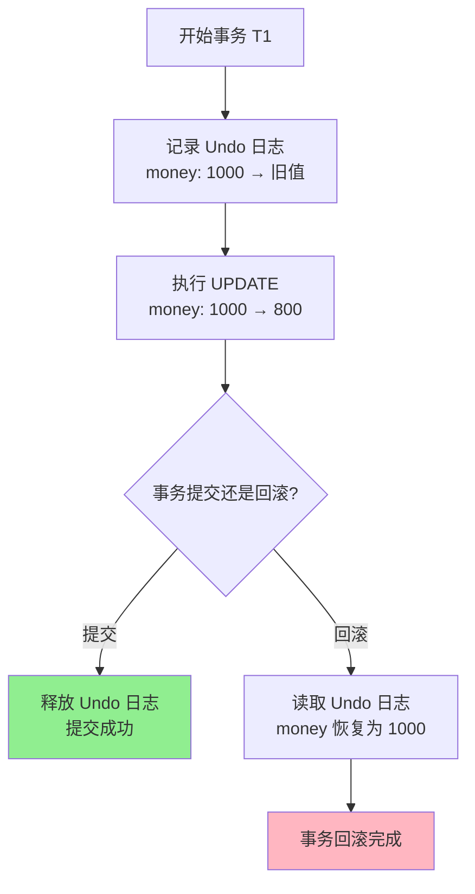

# Undo 日志详解

## 什么是 Undo 日志

**Undo 日志 = 用来撤销操作的日志**

记录的是"**修改前的值**"（旧值），用于在事务失败时回滚到修改前的状态。

### 为什么需要日志

在数据库系统中，日志是保证数据持久性和原子性的核心机制：

- **事务可能失败**：程序崩溃、系统宕机、硬件故障
- **我们需要恢复**：故障后要能恢复到一致状态
- **日志是关键**：先写日志再写数据（WAL - Write-Ahead Logging）

## Undo 日志格式

```sql
[Undo Log] <事务ID, 表名, 主键, 列名, 旧值>
```

## 具体示例

**场景**：银行转账 - 张三的账户从 1000 元扣款 200 元，变成 800 元

**初始状态**：
```
账户表 (accounts)
+----+--------+-------+
| id | name   | money |
+----+--------+-------+
| 1  | 张三   | 1000  |
| 2  | 李四   | 500   |
+----+--------+-------+
```

**执行 UPDATE 操作**：
```sql
UPDATE accounts SET money = money - 200 WHERE id = 1;
```

**生成的 Undo 日志**：
```
Undo Log: <事务T1, accounts, id=1, money, 旧值=1000>
```

**流程图解**：



## Undo 日志的作用

| 场景 | Undo 日志的作用 |
|------|----------------|
| 事务回滚 | 恢复到修改前的状态 |
| 读一致性 | 提供修改前的数据视图 |
| MVCC | 支持非锁定读取 |

## Undo 日志的存储位置

- **InnoDB**：系统表空间（ibdata）或独立的 undo tablespace
- **Oracle**：Undo 表空间
- **SQL Server**：在 tempdb 中管理

## Undo 日志与 MVCC

在 MVCC 中，每行数据包含两个隐藏字段：

| 隐藏字段 | 说明 |
|---------|------|
| `trx_id` | 最近修改该行数据的事务ID |
| `roll_pointer` | 指向 undo log 的指针，形成版本链 |

```
初始数据（trx_id=100）→ 修改后（trx_id=101）→ 再次修改（trx_id=102）
    ↑                      ↑                      ↑
  undo log              undo log              当前数据
```

**读一致性实现**：
1. 读取数据时，找到当前事务开始时的版本
2. 如果当前版本不可见，沿 Undo 链向上查找
3. 直到找到可见版本或最旧版本

## Undo 日志的生命周期

- 事务结束前保留
- 当所有可能需要读取旧版本的事务都结束后，Undo 日志可以被清理
- 在 MVCC 中，当没有活跃事务的 readview 包含该 Undo 记录时

## 面试要点

**Q：Undo 日志什么时候可以删除？**

A：当所有可能需要读取旧版本的事务都结束后，Undo 日志就可以被清理了。在 MVCC 中，就是当没有活跃事务的 readview 包含该 Undo 记录时。

## 参考链接

- [[Redo日志详解]] — Redo 日志（重做日志）
- [[Undo-Redo日志]] — Undo/Redo 对比与组合知识地图（MOC）
- [[事务ACID]] — 事务的原子性、一致性、隔离性、持久性
- [[MVCC-多版本并发控制]] — Undo 日志在 MVCC 中的应用
- [[隔离级别]] — 隔离级别对 Undo 日志使用的影响