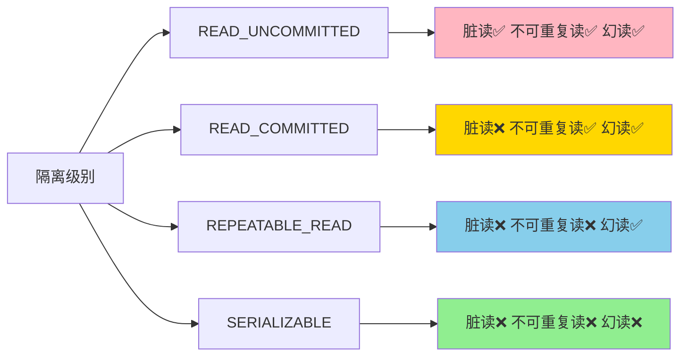

# 不可重复读（Non-repeatable Read）

## 什么是不可重复读？

> [!warning] 定义
> **不可重复读**是指在同一事务内，多次读取同一数据，结果不一致（因为其他事务更新了该数据并已提交）。

## 问题本质

不可重复读的核心问题是：**同一事务内多次读取，数据结果发生了变化**。

- 事务A第一次读取数据时，得到值 X
- 事务B在事务A读取后，修改了数据并提交
- 事务A再次读取数据时，得到值 Y（Y ≠ X）
- 事务A在同一个事务内看到了不一致的数据

## 与脏读的区别

> [!info] 重要区别
> - **脏读**：读取了**未提交**的数据（数据可能被回滚）
> - **不可重复读**：读取了**已提交**的数据（数据确定被修改）

```
脏读：读取未提交的数据
     ↓
     数据可能被回滚，结果"消失"

不可重复读：读取已提交的数据
     ↓
     数据确定被修改，结果"变化"
```

## 瑞幸场景示例

### 场景：查询用户咖啡券余额

**业务背景：** 用户在查看咖啡券余额的同时，会员系统可能正在更新用户的等级和积分。

```
时间线：

T1: 事务A开始，查询用户咖啡券余额
    → 第一次读取：余额 = 5张

T2: 事务B更新用户余额（+1张），提交
    → UPDATE coupon SET balance = 6 WHERE user_id = 1;
    → 事务B提交

T3: 事务A再次查询用户咖啡券余额
    → 第二次读取：余额 = 6张（与第一次不同！）

问题：事务A在同一个事务内看到了不一致的数据
     可能导致业务逻辑错误（如计算差值时）
```

### 场景：订单金额计算

```
初始：订单金额 = 100元

T1: 事务A读取订单金额 = 100元

T2: 事务B给订单打折，更新金额 = 80元，提交

T3: 事务A再次读取订单金额 = 80元

T4: 事务A计算优惠
    → 第一次读取时：优惠 = 100 - 100 = 0元
    → 第二次读取时：优惠 = 100 - 80 = 20元
    
问题：同一事务内计算出不同的优惠金额
```

## 不可重复读的危害

| 危害类型 | 说明 | 示例 |
|---------|------|------|
| **数据不一致** | 同一事务内数据不一致 | 计算结果前后矛盾 |
| **业务逻辑错误** | 基于不一致数据做决策 | 余额计算、统计错误 |
| **报表错误** | 数据统计不准确 | 月度报表数据异常 |
| **用户体验问题** | 界面显示数据跳动 | 页面刷新后数据变化 |

## 如何防止不可重复读？

### 1. 提高隔离级别

> [!tip] 解决方案
> 将数据库隔离级别设置为 **REPEATABLE_READ** 或更高，可以有效防止不可重复读。

| 隔离级别 | 不可重复读 | 说明 |
|---------|-----------|------|
| READ_UNCOMMITTED | ✅ 可能发生 | 读取最新数据 |
| READ_COMMITTED | ✅ 可能发生 | 每次读取生成新快照 |
| REPEATABLE_READ | ❌ 防止 | 事务开始时生成固定快照 |
| SERIALIZABLE | ❌ 防止 | 完全串行化 |

### 2. 使用 MVCC

> [!info] MVCC 原理
> **MVCC（多版本并发控制）** 通过为每个事务提供数据在某个时间点的快照来实现隔离性。

```sql
-- 事务A在开始时生成 Read View
BEGIN;

-- 第一次读取，看到版本1的数据
SELECT balance FROM coupon WHERE user_id = 1;
-- 结果：balance = 5

-- 事务B更新数据（生成版本2）
UPDATE coupon SET balance = 6 WHERE user_id = 1;
COMMIT;

-- 事务A再次读取，仍然看到版本1的数据
SELECT balance FROM coupon WHERE user_id = 1;
-- 结果：balance = 5（未变！）

COMMIT;
```

### 3. 使用锁机制

```sql
-- 使用排他锁防止其他事务修改
BEGIN;

SELECT * FROM orders WHERE id = 1 FOR UPDATE;
-- 其他事务无法修改 id=1 的订单，直到当前事务结束

-- 在锁保护下读取
SELECT amount FROM orders WHERE id = 1;
-- 结果一致

COMMIT;
```

## 不可重复读 vs 脏读 vs 幻读

### 三种并发异常对比

| 异常类型 | 问题描述 | 数据状态 | 隔离级别 |
|---------|---------|---------|---------|
| **脏读** | 读取未提交数据 | 数据可能回滚 | READ_UNCOMMITTED |
| **不可重复读** | 同一数据多次读取结果不同 | 数据已提交确定变化 | READ_COMMITTED |
| **幻读** | 同一查询结果集变化 | 新增或删除记录 | REPEATABLE_READ |

### 隔离级别与并发异常



## MVCC 中的不可重复读

### Read View 机制

> [!info] Read View 原理
> Read View（读视图）是事务在开启瞬间创建的"快照"，包含当前活跃事务的信息。

```
事务A开启时生成 Read View：
┌─────────────────────────────────┐
│  m_ids = [100]      活跃事务列表   │
│  min_trx_id = 100   最小事务ID    │
│  max_trx_id = 101   最大事务ID+1  │
│  creator_trx_id = 100 当前事务ID │
└─────────────────────────────────┘

当读取数据时：
- 如果 trx_id < min_trx_id → 数据可见（已提交）
- 如果 trx_id >= max_trx_id → 数据不可见（晚于Read View）
- 如果 trx_id 在 m_ids 中 → 数据不可见（未提交）
```

### 不可重复读的根源

在 **READ_COMMITTED** 隔离级别下：

```
T1: 事务A开启（trx_id=100），生成 Read View1
    → min_trx_id=100, max_trx_id=101

T2: 事务A查询余额 = 5（trx_id=99 < min_trx_id）

T3: 事务B开启（trx_id=101），修改余额=6，提交

T4: 事务A再次查询（重新生成 Read View2）
    → min_trx_id=100, max_trx_id=102
    → trx_id=101 < max_trx_id(102)，数据可见！
    → 余额 = 6（结果变化了）
```

在 **REPEATABLE_READ** 隔离级别下：

```
T1: 事务A开启（trx_id=100），生成固定 Read View
    → min_trx_id=100, max_trx_id=101
    → 这个 Read View 在整个事务期间保持不变！

T2: 事务A查询余额 = 5（trx_id=99 < min_trx_id）

T3: 事务B修改余额=6，提交（trx_id=101）

T4: 事务A再次查询（Read View 不变）
    → trx_id=101 在 m_ids 中吗？不在！
    → 但是 trx_id=101 >= max_trx_id(101)？
    → 是的，所以数据不可见！
    → 余额 = 5（结果不变）
```

## 实际开发建议

### 业务层面

> [!warning] 重要提醒
> 在 **READ_COMMITTED** 隔离级别下，同一事务内的多次查询可能返回不同结果，业务代码需要考虑这种场景。

```java
// ❌ 可能出问题的代码
@Transactional
public void processOrder(Long orderId) {
    Order order1 = orderRepository.findById(orderId);
    int amount1 = order1.getAmount();
    
    // 其他业务逻辑...
    
    Order order2 = orderRepository.findById(orderId);
    int amount2 = order2.getAmount();
    
    // amount1 != amount2 在 READ_COMMITTED 下可能发生！
    if (amount1 != amount2) {
        log.warn("金额发生了变化");
    }
}

// ✅ 更好的做法
@Transactional
public void processOrder(Long orderId) {
    Order order = orderRepository.findById(orderId);
    int originalAmount = order.getAmount();
    
    // 在事务内锁定数据，确保一致性
    // 或者使用 SERIALIZABLE 隔离级别
}
```

### 隔离级别选择

> [!tip] 选择建议
> - **READ_COMMITTED**：大多数互联网场景，防止脏读即可
> - **REPEATABLE_READ**：需要保证同一事务内数据一致性（如财务报表）
> - **SERIALIZABLE**：对数据一致性要求极高，但性能较差

## 总结

### 不可重复读的核心要点

```
不可重复读 = 同一事务内多次读取同一数据，结果不同

特征：
├── 数据已提交确定变化
├── 发生在 READ_COMMITTED 级别
├── 同一事务内数据不一致
└── 可能导致业务逻辑错误

解决方案：
├── 提高隔离级别（REPEATABLE_READ）
├── 使用 MVCC 机制
├── 使用锁机制（SELECT FOR UPDATE）
└── 业务代码考虑数据变化场景

发生场景：
├── READ_COMMITTED 隔离级别
├── 读写并发的事务
├── 长事务
└── 频繁更新的数据
```

### 与脏读、幻读的关系

> [!note] 关联阅读
> - [[脏读-Dirty-Read]] - 读取未提交数据，与不可重复读不同
> - [[幻读-Phantom-Read]] - 同一查询结果集变化，与不可重复读不同
> - [[隔离级别]] - 不可重复读发生在 READ_COMMITTED 级别
> - [[MVCC-多版本并发控制]] - MVCC 是防止不可重复读的关键机制
> - [[事务ACID]] - 不可重复读违反了隔离性（Isolation）

---

**文档信息**：
- 创建日期：2026-05-23
- 适用读者：后端开发工程师、数据库开发者
- 难度级别：入门
