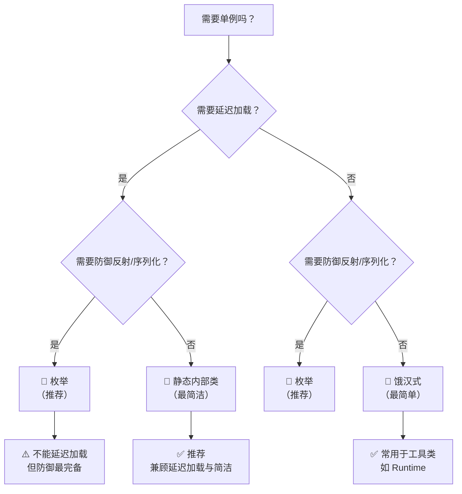

# 单例模式（Singleton Pattern）

> [!info] 一句话
> **单例模式**保证一个类**在整个 JVM 生命周期中只有一个实例**，并提供一个全局访问点。是 GoF 23 种设计模式中最简单、也最常被考察的模式之一。

## 适用场景

| 场景 | 原因 | 典型例子 |
|------|------|----------|
| **无状态工具类** | 无成员变量，不会因复用而出错 | `Runtime`、`ObjectMapper` |
| **共享资源** | 避免重复创建、控制并发访问 | 线程池、数据库连接池 |
| **配置类** | 全局只有一份配置即可 | Spring `@Configuration` 的 Bean |
| **日志/监控** | 统一的日志输出或监控入口 | 日志框架的 LoggerFactory |

> 面试提示：记 2~3 个 JDK/框架中的单例就能说服面试官你真的用过。
> - [[Runtime类详解]] — `Runtime.getRuntime()` 饿汉式单例
> - [[Jackson-ObjectMapper]] — 线程安全，建议复用单例
> - Spring Bean（默认 scope = singleton）

---

## 一、饿汉式（Eager Initialization）

```java
public class EagerSingleton {
    // 类加载时即创建实例（static final 保证线程安全）
    private static final EagerSingleton INSTANCE = new EagerSingleton();
    
    private EagerSingleton() {}  // 私有构造
    
    public static EagerSingleton getInstance() {
        return INSTANCE;
    }
}
```

### 特点

| 维度 | 评价 |
|------|------|
| **线程安全** | ✅ 由类加载机制保证（JVM 保证 `clinit` 方法同步） |
| **延迟加载** | ❌ 类加载即创建，即使从未使用 |
| **实现复杂度** | ⭐ 最简单 |
| **反序列化破坏** | ❌ 需实现 `readResolve()` |
| **反射破坏** | ❌ 可通过 `setAccessible(true)` 调用私有构造 |

### JDK 经典案例

`Runtime.getRuntime()` 就是标准的饿汉式单例：

```java
// java.lang.Runtime（简化）
public class Runtime {
    private static final Runtime currentRuntime = new Runtime();
    public static Runtime getRuntime() { return currentRuntime; }
    private Runtime() {}
}
```

详见 [[Runtime类详解]]。

---

## 二、懒汉式（Lazy Initialization）

### 基础版（非线程安全 ❌）

```java
public class LazySingleton {
    private static LazySingleton instance;
    
    private LazySingleton() {}
    
    public static LazySingleton getInstance() {
        if (instance == null) {         // 多线程下可能同时进入
            instance = new LazySingleton();
        }
        return instance;
    }
}
```

> [!danger] 非线程安全
> 两个线程同时进入 `if (instance == null)`，会创建两个实例，违反单例。**生产环境不要使用。**

### 线程安全版（方法加锁 ✅）

```java
public class LazySyncSingleton {
    private static LazySyncSingleton instance;
    
    private LazySyncSingleton() {}
    
    public static synchronized LazySyncSingleton getInstance() {
        if (instance == null) {
            instance = new LazySyncSingleton();
        }
        return instance;
    }
}
```

| 维度 | 评价 |
|------|------|
| **线程安全** | ✅ `synchronized` 保证互斥 |
| **性能** | ❌ 每次获取实例都要加锁，高并发下性能瓶颈明显 |

> 问题在于：实例创建后，**所有**读操作都被 `synchronized` 串行化了，而我们只需要在**第一次创建**时同步。

---

## 三、双重检查锁定（Double-Checked Locking, DCL） ⭐

```java
public class DCLSingleton {
    // volatile 禁止指令重排序，防止读到未初始化完成的对象
    private static volatile DCLSingleton instance;
    
    private DCLSingleton() {}
    
    public static DCLSingleton getInstance() {
        if (instance == null) {                    // 第一重检查：无锁快速判断
            synchronized (DCLSingleton.class) {    // 只有第一次才进入
                if (instance == null) {            // 第二重检查：确认确实是第一次
                    instance = new DCLSingleton();
                }
            }
        }
        return instance;
    }
}
```

### 为什么需要 `volatile`？

`instance = new DCLSingleton()` 在字节码层面分三步：

```
1. memory = allocate();    // 分配内存空间
2. initInstance(memory);   // 初始化对象
3. instance = memory;      // 将引用指向内存地址
```

如果 **没有 volatile**，步骤 2 和 3 可能被重排序为 1→3→2。此时另一个线程在第一重检查发现 `instance != null`，直接返回一个**未初始化完成**的对象，访问其字段会崩溃。

> `volatile` 通过**内存屏障**禁止步骤 2/3 重排序，详见 [[volatile关键字详解#典型应用场景]]。

### 特点

| 维度 | 评价 |
|------|------|
| **线程安全** | ✅ volatile + synchronized |
| **延迟加载** | ✅ 第一次调用时才创建 |
| **性能** | ✅ 创建后无锁访问（只有第一次进入同步块） |
| **实现复杂度** | ⭐⭐⭐ 需理解 volatile 和指令重排序 |
| **反序列化破坏** | ❌ 需实现 `readResolve()` |
| **反射破坏** | ❌ 可通过反射调用私有构造 |

> 面试最常考察的实现方式，重点理解 `volatile` 的作用。

---

## 四、静态内部类（Initialization-on-Demand Holder） ⭐

```java
public class HolderSingleton {
    
    private HolderSingleton() {}
    
    // 静态内部类在 HolderSingleton 加载时不会初始化
    private static class Holder {
        private static final HolderSingleton INSTANCE = new HolderSingleton();
    }
    
    public static HolderSingleton getInstance() {
        return Holder.INSTANCE;  // 触发 Holder 类加载，创建实例
    }
}
```

### 原理

- JVM 加载 `HolderSingleton` 时，**不会**加载内部类 `Holder`
- 第一次调用 `getInstance()` 时，JVM 加载 `Holder` 类，触发其 `clinit` 方法创建实例
- JVM 保证类的 `clinit` 是线程安全的（同一类在同一时间只有一个线程能执行 `clinit`）

### 特点

| 维度 | 评价 |
|------|------|
| **线程安全** | ✅ JVM 类加载机制保证 |
| **延迟加载** | ✅ 内部类在 getInstance() 首次访问时加载 |
| **性能** | ✅ 无锁，类加载后开销为零 |
| **实现复杂度** | ⭐⭐ 简洁且无额外关键字 |
| **反序列化破坏** | ❌ 需实现 `readResolve()` |

> 最**推荐**的 Java 单例实现方式 —— 兼具延迟加载、线程安全、零同步开销。比 DCL 更简洁、更安全。

---

## 五、枚举实现（Enum Singleton） ⭐⭐⭐

```java
public enum EnumSingleton {
    INSTANCE;
    
    private String config;
    
    public void doSomething() {
        System.out.println("执行单例方法");
    }
    
    // 可以有成员变量和方法
    public String getConfig() { return config; }
    public void setConfig(String config) { this.config = config; }
}
```

使用方式：

```java
EnumSingleton.INSTANCE.doSomething();
EnumSingleton.INSTANCE.setConfig("prod");
```

### 特点

| 维度 | 评价 |
|------|------|
| **线程安全** | ✅ 枚举实例创建由 JVM 保证 |
| **延迟加载** | ❌ 枚举类加载时即创建（近似饿汉式） |
| **反序列化破坏** | ✅ **天然防御** — JVM 保证每个枚举常量只有一个实例 |
| **反射破坏** | ✅ **天然防御** — 反射不能通过构造创建枚举 |
| **实现复杂度** | ⭐ 最简单 |

> Joshua Bloch（Effective Java 作者）**强烈推荐**枚举实现 —— 它是唯一能**完全防御**反射和序列化攻击的单例实现。

### 枚举 vs 其他实现的防御对比

```java
// ❌ 普通单例：反射破坏
Constructor<?> constructor = DCLSingleton.class.getDeclaredConstructor();
constructor.setAccessible(true);
DCLSingleton another = (DCLSingleton) constructor.newInstance();  // 成功创建第二个实例

// ✅ 枚举单例：反射无法破坏
Constructor<?> constructor = EnumSingleton.class.getDeclaredConstructor(String.class, int.class);
constructor.setAccessible(true);
EnumSingleton another = (EnumSingleton) constructor.newInstance();
// 抛出 java.lang.IllegalArgumentException: Cannot reflectively create enum objects
```

> 来自《Effective Java》第 3 条：**"使用枚举实现单例"**

---

## 六、各实现方式对比总表

| 实现方式 | 线程安全 | 延迟加载 | 防反射 | 防序列化 | 性能 | 推荐度 |
|----------|----------|----------|--------|----------|------|--------|
| 饿汉式 | ✅ | ❌ | ❌ | ❌ | ⭐⭐⭐ | ⭐⭐ |
| 懒汉式（非同步） | ❌ | ✅ | ❌ | ❌ | ⭐⭐⭐ | ❌勿用 |
| 懒汉式（同步） | ✅ | ✅ | ❌ | ❌ | ⭐ | ⭐ |
| **DCL 双重检查** | ✅ | ✅ | ❌ | ❌ | ⭐⭐⭐ | ⭐⭐⭐ |
| **静态内部类** | ✅ | ✅ | ❌ | ❌ | ⭐⭐⭐ | ⭐⭐⭐⭐ |
| **枚举** | ✅ | ❌ | ✅ | ✅ | ⭐⭐⭐ | ⭐⭐⭐⭐⭐ |

---

## 七、破坏单例的几种方式

### 1. 反射攻击

```java
// 防御方式：在私有构造中加标志位
public class SafeSingleton {
    private static boolean initialized = false;
    
    private SafeSingleton() {
        synchronized (SafeSingleton.class) {
            if (initialized) {
                throw new RuntimeException("单例被破坏！");
            }
            initialized = true;
        }
    }
}
```

### 2. 序列化破坏

```java
// 防御方式：实现 readResolve() 方法
public class SerializableSingleton implements Serializable {
    private static final SerializableSingleton INSTANCE = new SerializableSingleton();
    
    private SerializableSingleton() {}
    
    // 反序列化时直接返回已有实例，而不是创建新对象
    private Object readResolve() {
        return INSTANCE;
    }
}
```

### 3. 克隆破坏

```java
// 防御方式：重写 clone() 方法
@Override
public Object clone() throws CloneNotSupportedException {
    throw new CloneNotSupportedException("单例不允许克隆");
    // 或直接 return INSTANCE;
}
```

---

## 八、Spring 中的单例

Spring IoC 容器的默认 scope 是 `singleton`，但**不同于 GoF 单例**：

| 对比维度 | GoF 单例 | Spring 单例 |
|----------|----------|-------------|
| 控制方式 | 类自身控制（`private` 构造） | 容器控制（IoC 容器管理） |
| 实例个数 | 整个 JVM 唯一 | **每个容器**一个实例（多个容器可有多个） |
| 实现方式 | 编码实现 | 默认 scope，无特殊限制 |
| 线程安全 | 需自行保证状态安全 | 无状态 Bean 安全，有状态需额外处理 |

```java
@Component  // Spring 默认就是单例
public class UserService {
    // 无状态服务，天然线程安全
}
```

---

## 九、代码选择指南



---

## 相关笔记

- [[Runtime类详解]] — `Runtime.getRuntime()` 饿汉式单例的典型应用
- [[Runtime.availableProcessors]] — Runtime 类方法详解
- [[volatile关键字详解]] — DCL 中 `volatile` 的原理和作用
- [[Jackson-ObjectMapper]] — 线程安全，建议复用单例（框架级单例）
- [[Java关键字-transient与volatile]] — volatile 的指令重排序问题
