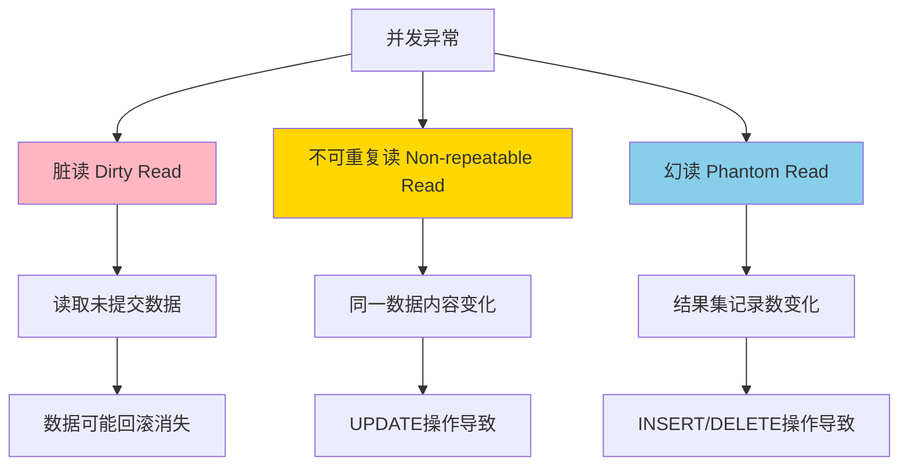

# 幻读（Phantom Read）

## 什么是幻读？

> [!warning] 定义
> **幻读**是指在同一事务内，多次执行同一查询，结果集不一致（因为其他事务插入或删除了符合条件的记录）。

## 问题本质

幻读的核心问题是：**同一查询返回的记录数发生了变化**。

- 事务A第一次执行查询，得到 N 条记录
- 事务B在事务A查询后，插入了符合查询条件的新记录并提交
- 事务A再次执行同一查询，得到 N+1 条记录（多了"幻影"记录）
- 或者事务A再次执行查询，得到 N-1 条记录（少了记录）

## 幻读 vs 不可重复读

> [!info] 重要区别
> - **不可重复读**：同一数据**内容**发生变化（UPDATE）
> - **幻读**：同一查询**结果集**发生变化（INSERT/DELETE）

```
不可重复读：同一数据内容变化
     ↓
     读取的是同一条记录，但值变了

幻读：查询结果集记录数变化
     ↓
     读取的是多个记录，多了或少了几条记录
```

## 瑞幸场景示例

### 场景：查询库存不足的咖啡列表

**业务背景：** 后台管理系统查询所有库存不足10杯的咖啡，准备补货。同时，运营人员可能在上架新品。

```
时间线：

T1: 事务A查询"库存<10的咖啡列表"
    → 第一次查询：返回 5 条记录（5款咖啡库存不足）

T2: 事务B上架新品，库存设为 8 杯，提交
    → INSERT INTO coffee (name, stock) VALUES ('新品咖啡', 8);
    → 事务B提交

T3: 事务A再次查询"库存<10的咖啡列表"
    → 第二次查询：返回 6 条记录（多了1条！像幻觉一样）

问题：事务A以为只有5款咖啡库存不足
     但实际上有6款（多了个"幻影"）
```

### 场景：统计符合条件的订单数量

```
初始：订单表中有 100 条符合条件的订单

T1: 事务A统计符合条件的订单数量 = 100

T2: 事务B批量插入 10 条新订单，提交

T3: 事务A再次统计 = 110

T4: 事务A准备处理这 100 条订单
    → 但实际上有 110 条，多处理了 10 条"幻影"订单
```

### 场景：删除操作中的幻读

```
T1: 事务A查询所有未支付的订单（10条）

T2: 事务B插入 2 条新订单（未支付），提交

T3: 事务A再次查询未支付订单（12条）

T4: 事务A执行批量删除未支付订单
    → 删除了 12 条订单（包括新插入的 2 条）
    
问题：事务A原计划删除 10 条订单
     但实际删除了 12 条，多删了 2 条
```

## 幻读的危害

| 危害类型 | 说明 | 示例 |
|---------|------|------|
| **数据不一致** | 结果集记录数不一致 | 查询结果"变多"或"变少" |
| **业务逻辑错误** | 基于不准确的记录数做决策 | 补货数量错误、处理错误数量的订单 |
| **重复操作** | 处理了不应该处理的记录 | 重复发放优惠券、重复扣款 |
| **遗漏操作** | 漏处理了应该处理的记录 | 漏发通知、漏处理订单 |

## 如何防止幻读？

### 1. 提高隔离级别

> [!tip] 解决方案
> 将数据库隔离级别设置为 **SERIALIZABLE**，可以有效防止幻读。

| 隔离级别 | 幻读 | 说明 |
|---------|------|------|
| READ_UNCOMMITTED | ✅ 可能发生 | 无隔离 |
| READ_COMMITTED | ✅ 可能发生 | 每次读取生成新快照 |
| REPEATABLE_READ | ✅ 可能发生（部分） | 快照读防止，但当前读可能发生 |
| SERIALIZABLE | ❌ 防止 | 完全串行化，锁定范围 |

### 2. 使用锁机制（范围锁）

> [!info] 范围锁原理
> 通过锁定查询涉及的数据范围（包括间隙），防止其他事务在范围内插入或删除数据。

```sql
-- 使用范围锁防止幻读
BEGIN;

-- 锁定库存<10的咖啡（锁定这个范围，防止插入/删除）
SELECT * FROM coffee WHERE stock < 10 FOR UPDATE;
-- 其他事务无法在这个范围内插入新记录

COMMIT;
```

### 3. 快照读 vs 当前读

> [!warning] 重要区别
> 在 **REPEATABLE_READ** 隔离级别下，MVCC 可以防止快照读的幻读，但无法防止当前读的幻读。

| 读取类型 | 说明 | 是否受MVCC保护 | 是否防止幻读 |
|---------|------|---------------|-------------|
| **快照读** | 普通 SELECT 语句 | ✅ 是 | ✅ 防止（RR级别） |
| **当前读** | SELECT ... FOR UPDATE | ❌ 否 | ❌ 可能幻读 |
| **当前读** | INSERT/UPDATE/DELETE | ❌ 否 | ❌ 可能幻读 |

```sql
-- 快照读（不会幻读，RR级别）
SELECT * FROM coffee WHERE stock < 10;
-- 在整个事务期间，看到的都是事务开始时的数据快照

-- 当前读（可能幻读）
SELECT * FROM coffee WHERE stock < 10 FOR UPDATE;
-- 读取最新数据，可能看到新插入的记录
```

### 4. MySQL InnoDB 的 Next-Key Lock

> [!info] Next-Key Lock
> InnoDB 使用 **Next-Key Lock**（记录锁 + 间隙锁）来防止幻读，锁定查询范围内的所有间隙。

```sql
-- 假设 coffee 表有 stock 值为：5, 10, 15, 20

-- 查询 stock < 10
SELECT * FROM coffee WHERE stock < 10 FOR UPDATE;

-- Next-Key Lock 会锁定：
-- 1. stock = 5 的记录（记录锁）
-- 2. (5, 10) 的间隙（间隙锁）
-- 3. 负无穷到 5 的间隙

-- 其他事务无法插入 stock = 6, 7, 8, 9 的记录
```

## 幻读 vs 不可重复读 vs 脏读

### 三种并发异常对比

| 异常类型 | 问题描述 | 变化内容 | 隔离级别 |
|---------|---------|---------|---------|
| **脏读** | 读取未提交数据 | 数据可能不存在 | READ_UNCOMMITTED |
| **不可重复读** | 同一数据多次读取结果不同 | **数据内容变化** | READ_COMMITTED |
| **幻读** | 同一查询结果集变化 | **记录数变化** | REPEATABLE_READ |

### 详细对比



### 隔离级别与并发异常

| 隔离级别 | 脏读 | 不可重复读 | 幻读 | 说明 |
|---------|------|-----------|------|------|
| READ_UNCOMMITTED | ✅ | ✅ | ✅ | 无隔离 |
| READ_COMMITTED | ❌ | ✅ | ✅ | 防止脏读 |
| REPEATABLE_READ | ❌ | ❌ | ✅（快照读防止） | MySQL默认级别 |
| SERIALIZABLE | ❌ | ❌ | ❌ | 完全串行化 |

## MVCC 中的幻读

### 快照读防止幻读

> [!info] MVCC 原理
> MVCC 通过快照读可以防止幻读，因为快照是基于事务开始时的数据状态。

```
REPEATABLE_READ 隔离级别下的快照读：

T1: 事务A开启，生成 Read View

T2: 事务A查询"库存<10的咖啡"
    → 快照结果：5条记录

T3: 事务B插入1条库存=8的咖啡，提交

T4: 事务A再次查询"库存<10的咖啡"（快照读）
    → 仍然返回5条记录（快照未变）
    → 没有幻读！
```

### 当前读无法防止幻读

```
REPEATABLE_READ 隔离级别下的当前读：

T1: 事务A开启

T2: 事务A使用 FOR UPDATE 查询"库存<10的咖啡"
    → 返回5条记录（当前读）

T3: 事务B插入1条库存=8的咖啡，提交

T4: 事务A再次使用 FOR UPDATE 查询"库存<10的咖啡"
    → 返回6条记录（多了1条！）
    → 发生幻读！
```

## 实际开发建议

### 1. 选择合适的隔离级别

> [!tip] 选择建议
> - **READ_COMMITTED**：大多数场景，防止脏读即可
> - **REPEATABLE_READ**：需要防止不可重复读，但性能较好（MySQL默认）
> - **SERIALIZABLE**：对数据一致性要求极高，性能较差

### 2. 使用事务避免幻读

```java
// ❌ 可能幻读的场景
@Transactional
public void processLowStockCoffee() {
    List<Coffee> lowStockList = coffeeRepository.findByStockLessThan(10);
    // 第一次查询：5条
    
    // 业务逻辑...
    
    List<Coffee> lowStockList2 = coffeeRepository.findByStockLessThan(10);
    // 第二次查询：可能变成6条！
    
    // 处理结果不一致
}

// ✅ 使用当前读避免幻读（配合锁）
@Transactional
public void processLowStockCoffee() {
    @Query("SELECT c FROM Coffee c WHERE c.stock < 10 FOR UPDATE")
    List<Coffee> findLowStockWithLock();
    
    // 使用 FOR UPDATE 锁定范围，防止幻读
    List<Coffee> lowStockList = findLowStockWithLock();
    
    // 整个事务期间，查询结果一致
    // 不会发生幻读
}
```

### 3. 合理使用索引

> [!warning] 重要提醒
> 幻读主要发生在范围查询中，合理使用索引可以提高锁的精确度，减少锁的范围。

```sql
-- 好的索引设计
CREATE INDEX idx_stock ON coffee(stock);

-- 查询时会锁定 stock < 10 的范围
SELECT * FROM coffee WHERE stock < 10 FOR UPDATE;
-- 锁定的间隙较小

-- 缺少索引
-- 可能导致全表扫描，锁定更大的范围
```

## 总结

### 幻读的核心要点

```
幻读 = 同一查询结果集记录数发生变化

特征：
├── 记录数增加或减少
├── 由 INSERT/DELETE 操作导致
├── 发生在范围查询中
└── 可能导致业务逻辑错误

解决方案：
├── 提高隔离级别（SERIALIZABLE）
├── 使用范围锁（FOR UPDATE）
├── 使用 Next-Key Lock（InnoDB）
└── 合理设计索引

发生场景：
├── REPEATABLE_READ 隔离级别（当前读）
├── 范围查询（WHERE ... <, >, BETWEEN）
├── 插入/删除操作
└── 并发事务
```

### 与不可重复读的区别

```
幻读：结果集记录数变化（INSERT/DELETE）
     ├── 第一次查询：5条记录
     └── 第二次查询：6条记录

不可重复读：同一数据内容变化（UPDATE）
     ├── 第一次查询：某条记录 stock=5
     └── 第二次查询：同一条记录 stock=6
```

### 与脏读、不可重复读的关系

> [!note] 关联阅读
> - [[脏读-Dirty-Read]] - 读取未提交数据，与幻读不同
> - [[不可重复读-Non-repeatable-Read]] - 数据内容变化，与幻读不同
> - [[隔离级别]] - 幻读主要发生在 REPEATABLE_READ 级别
> - [[MVCC-多版本并发控制]] - MVCC 可以防止快照读的幻读
> - [[事务ACID]] - 幻读违反了隔离性（Isolation）

---

**文档信息**：
- 创建日期：2026-05-23
- 适用读者：后端开发工程师、数据库开发者
- 难度级别：入门
