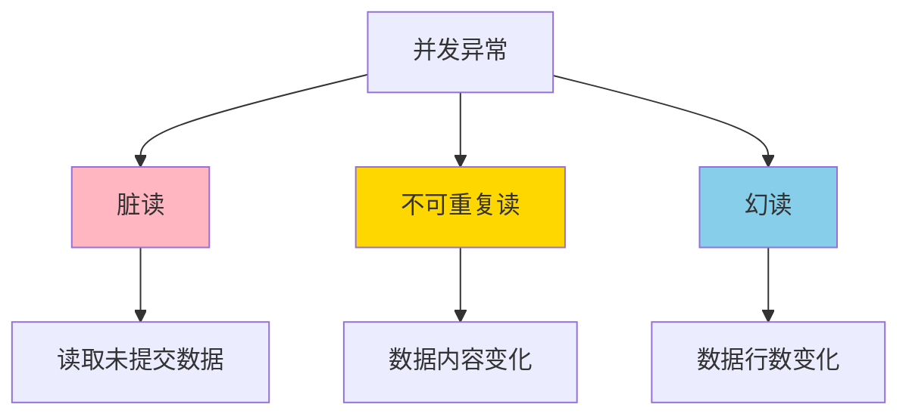

# 脏读（Dirty Read）

## 什么是脏读？

> [!warning] 定义
> **脏读**是指一个事务读取了**另一个事务未提交**的数据，这些数据可能会被回滚，导致读取到无效或不存在的数据。

## 问题本质

脏读的核心问题是：**读取了可能不存在的数据**。

- 事务A修改了数据但尚未提交
- 事务B读取了这些未提交的修改
- 如果事务A回滚，事务B读取的数据就变成了"脏数据"

## 瑞幸场景示例

### 场景：用户查询订单详情

**业务背景：** 用户正在查看订单详情，同时另一个操作正在取消该订单。

```
时间线：

T1: 事务A（取消订单）将订单状态从"已完成"改为"已取消"
    → 订单状态 = "已取消"（未提交）

T2: 事务B（用户查询）读取订单状态
    → 读到订单状态 = "已取消"（脏读！）

T3: 事务A因某些原因回滚
    → 订单状态恢复为"已完成"

T4: 事务B基于错误的"已取消"状态继续处理
    → 可能导致错误的业务流程（如拒绝用户操作本可完成的订单）
```

### 另一个典型场景：余额查询

```
初始：用户余额 = 1000元

T1: 事务A（转账）扣除用户余额
    → 余额 = 800元（未提交）

T2: 事务B（查询）读取用户余额
    → 读到余额 = 800元（脏读！）

T3: 事务A回滚（转账失败）
    → 余额恢复为 1000元

T4: 用户看到账户余额为800元，但实际余额是1000元
    → 用户可能会质疑账户金额
```

## 脏读的危害

| 危害类型 | 说明 | 示例 |
|---------|------|------|
| **数据不一致** | 读取了不存在的数据 | 订单状态显示"已取消"但实际是"已完成" |
| **业务逻辑错误** | 基于错误数据做决策 | 拒绝本可完成的用户操作 |
| **用户体验问题** | 显示错误信息 | 用户看到错误的账户余额 |
| **资金风险** | 金融场景可能造成损失 | 基于错误的余额进行交易 |

## 如何防止脏读？

### 1. 提高隔离级别

> [!tip] 解决方案
> 将数据库隔离级别设置为 **READ_COMMITTED** 或更高，可以有效防止脏读。

| 隔离级别 | 脏读 | 说明 |
|---------|------|------|
| READ_UNCOMMITTED | ✅ 可能发生 | 允许读取未提交的数据 |
| READ_COMMITTED | ❌ 防止 | 只能读取已提交的数据 |
| REPEATABLE_READ | ❌ 防止 | 同一事务内多次读取一致 |
| SERIALIZABLE | ❌ 防止 | 完全串行化 |

### 2. 使用锁机制

```sql
-- 使用读锁防止脏读
BEGIN TRANSACTION;

-- 其他事务的未提交修改无法被读取
SELECT * FROM orders WHERE id = 1;

COMMIT;
```

### 3. MySQL 中的脏读防护

```sql
-- 设置隔离级别为 READ COMMITTED
SET TRANSACTION ISOLATION LEVEL READ COMMITTED;

-- 或者在连接中设置
SET SESSION transaction_isolation = 'READ-COMMITTED';
```

## 脏读 vs 其他并发异常

### 三种并发异常对比

> [!info] 并发异常家族
> 脏读、不可重复读、幻读是数据库并发中的三种典型异常，它们都与事务隔离相关。

| 异常类型 | 问题描述 | 涉及的操作 | 隔离级别要求 |
|---------|---------|-----------|-------------|
| **脏读** | 读取未提交的数据 | 读操作 | 至少 READ_COMMITTED |
| **不可重复读** | 同一事务内多次读取结果不同 | 读操作 | 至少 REPEATABLE_READ |
| **幻读** | 同一事务内查询结果集变化 | 读操作（范围查询） | 需要 SERIALIZABLE |

### 关系图



## 实际开发建议

### 业务层面

> [!warning] 重要提醒
> 即使数据库防止了脏读，业务代码中也应该避免基于可能回滚的数据做重要决策。

```java
// ❌ 不好的实践：基于未验证的数据做决策
@Transactional
public void processOrder(Long orderId) {
    Order order = orderRepository.findById(orderId);
    // 不要在这里做重要决策，因为事务可能回滚
    if (order.getStatus().equals("PROCESSING")) {
        // 可能出现脏读导致的状态不一致
        processPayment();
    }
}

// ✅ 好的实践：在事务提交后再做决策
@Transactional
public void processOrder(Long orderId) {
    Order order = orderRepository.findById(orderId);
    order.setStatus("PROCESSING");
    orderRepository.save(order);
}

public void afterCommit() {
    // 在事务提交后执行，避免脏读影响
    processPayment();
}
```

### 数据库配置

> [!tip] 生产环境建议
> - 生产环境强烈建议使用 **READ_COMMITTED** 或更高隔离级别
> - 避免使用 **READ_UNCOMMITTED**，除非有特殊需求且清楚其风险
> - 定期监控和审查隔离级别配置

## 总结

### 脏读的核心要点

```
脏读 = 读取了另一个事务未提交的数据

特征：
├── 读取了可能不存在的数据
├── 数据可能被回滚
├── 导致业务逻辑错误
└── 读取到不一致的数据

解决方案：
├── 提高隔离级别（至少 READ_COMMITTED）
├── 使用锁机制
└── 业务层面避免基于未提交数据做决策

发生场景：
├── READ_UNCOMMITTED 隔离级别
├── 读写并发的事务
└── 高并发数据库操作
```

### 与其他异常的关系

> [!note] 关联阅读
> - [[隔离级别]] - 脏读发生在 READ_UNCOMMITTED 级别
> - [[不可重复读-Non-repeatable-Read]] - 同为并发异常，但问题不同
> - [[幻读-Phantom-Read]] - 同为并发异常，但涉及范围查询
> - [[事务ACID]] - 脏读违反了隔离性（Isolation）

---

**文档信息**：
- 创建日期：2026-05-23
- 适用读者：后端开发工程师、数据库开发者
- 难度级别：入门
