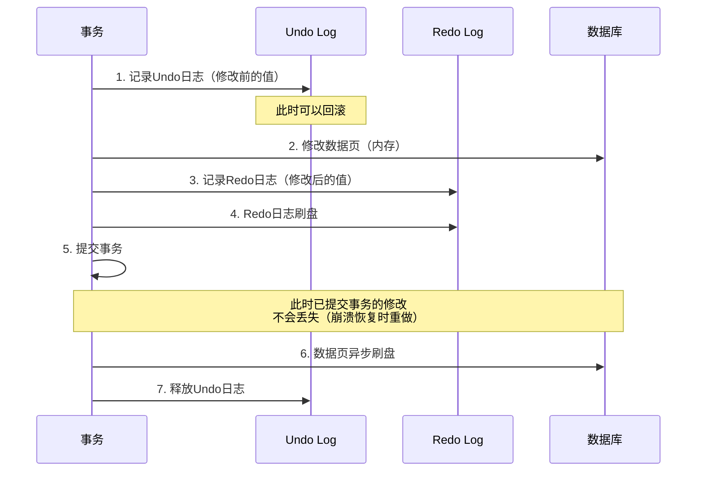
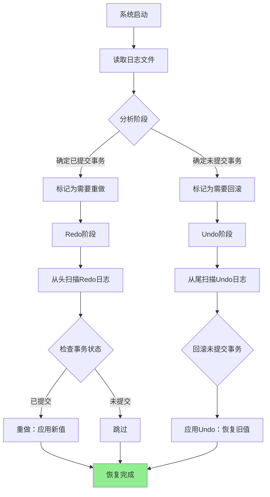

# Undo/Redo 日志 — 知识地图

> [!abstract] 本笔记为 MOC（Map of Content）
> **Undo 日志**用于回滚事务（记住"旧值"），**Redo 日志**用于崩溃恢复（记住"新值"）。两者配合，共同保证数据库的原子性和持久性。

## 原子笔记

| 笔记 | 简介 |
|------|------|
| [[Undo日志详解]] | 回滚日志：记录修改前的旧值，支持事务回滚、MVCC 读一致性 |
| [[Redo日志详解]] | 重做日志：记录修改后的新值，遵循 WAL 原则，保证崩溃恢复 |

## Undo vs Redo 对比

| 对比项 | Undo 日志 | Redo 日志 |
|--------|----------|----------|
| **记录内容** | 修改前的值（旧值） | 修改后的值（新值） |
| **用途** | 回滚事务、读一致性 | 崩溃恢复、持久性 |
| **写入时机** | 修改数据前 | 修改数据后/提交前 |
| **作用方向** | 反向操作（撤销） | 正向操作（重做） |
| **生命周期** | 事务结束前保留 | 持久化到事务提交后 |

## 完整的事务流程



## 崩溃恢复流程



## 核心要点

```
┌────────────────────────────────────────────────────────┐
│                    Undo/Redo 要点                       │
├────────────────────────────────────────────────────────┤
│                                                        │
│  Undo 日志：                                            │
│  ├── 记录"旧值"，用于回滚                               │
│  ├── 支持 MVCC 和读一致性                               │
│  └── 事务回滚时必须                                     │
│                                                        │
│  Redo 日志：                                            │
│  ├── 记录"新值"，用于重做                               │
│  ├── 先于数据页写入磁盘（WAL）                          │
│  └── 崩溃恢复时必须                                     │
│                                                        │
│  两者结合：                                             │
│  ├── 保证原子性（Undo）                                 │
│  ├── 保证持久性（Redo）                                 │
│  └── 支持高效的崩溃恢复                                 │
│                                                        │
└────────────────────────────────────────────────────────┘
```

## 面试要点

**Q：能否只用 Undo 或只用 Redo？**

A：
- 只用 Undo：无法恢复已提交事务的修改（丢失持久性）
- 只用 Redo：无法回滚未提交事务（无法保证原子性）
- 两者都需要，缺一不可

## 参考链接

- [[Undo日志详解]] — Undo 日志原子笔记
- [[Redo日志详解]] — Redo 日志原子笔记
- [[事务ACID]] — 事务的四大特性
- [[MVCC-多版本并发控制]] — Undo 日志在 MVCC 中的应用
- [[隔离级别]] — 隔离级别对日志使用的影响
- [[Mysql常用配置]] — MySQL 8 Undo/Redo 日志配置
